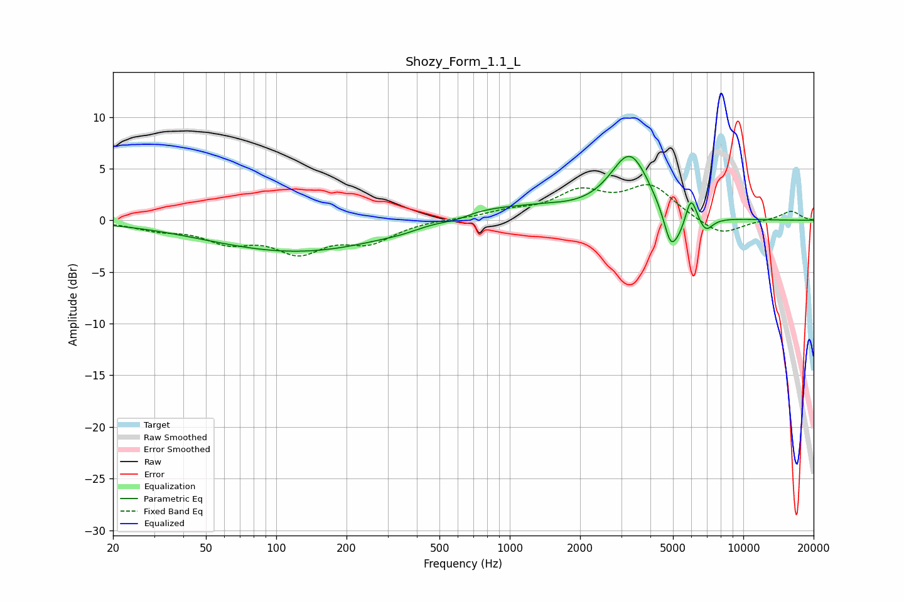

# Shozy_Form_1.1_L
See [usage instructions](https://github.com/jaakkopasanen/AutoEq#usage) for more options and info.

### Parametric EQs
Apply preamp of -6.3 dB when using parametric equalizer.

|   # | Type    |   Fc (Hz) |    Q |   Gain (dB) |
|-----|---------|-----------|------|-------------|
|   1 | Peaking |       128 | 0.36 |        -3.1 |
|   2 | Peaking |       352 | 1.51 |        -0.3 |
|   3 | Peaking |       585 | 2    |        -0.5 |
|   4 | Peaking |       708 | 0.59 |         1.5 |
|   5 | Peaking |      1426 | 1.17 |         0.5 |
|   6 | Peaking |      3276 | 1.63 |         6.3 |
|   7 | Peaking |      4867 | 5.15 |        -2.3 |
|   8 | Peaking |      5241 | 2.68 |        -2.6 |
|   9 | Peaking |      5966 | 5.58 |         2.9 |
|  10 | Peaking |      6898 | 4.48 |        -1.4 |

### Fixed Band EQs
When using fixed band (also called graphic) equalizer, apply preamp of **-3.5 dB** (if available) and set gains manually with these parameters.

|   # | Type    |   Fc (Hz) |    Q |   Gain (dB) |
|-----|---------|-----------|------|-------------|
|   1 | Peaking |        31 | 1.41 |        -0.7 |
|   2 | Peaking |        62 | 1.41 |        -1.8 |
|   3 | Peaking |       125 | 1.41 |        -2.8 |
|   4 | Peaking |       250 | 1.41 |        -1.9 |
|   5 | Peaking |       500 | 1.41 |         0.1 |
|   6 | Peaking |      1000 | 1.41 |         0.7 |
|   7 | Peaking |      2000 | 1.41 |         2.5 |
|   8 | Peaking |      4000 | 1.41 |         3.2 |
|   9 | Peaking |      8000 | 1.41 |        -1.6 |
|  10 | Peaking |     16000 | 1.41 |         0.9 |

### Graphs

