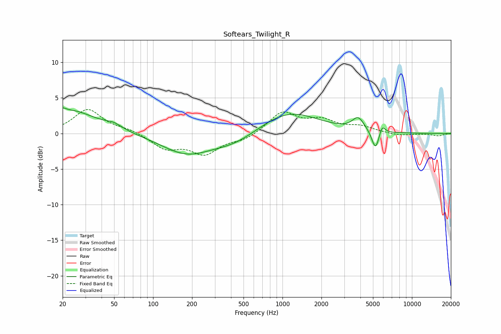

# Softears_Twilight_R
See [usage instructions](https://github.com/jaakkopasanen/AutoEq#usage) for more options and info.

### Parametric EQs
Apply preamp of -3.7 dB when using parametric equalizer.

|   # | Type    |   Fc (Hz) |    Q |   Gain (dB) |
|-----|---------|-----------|------|-------------|
|   1 | Peaking |        20 | 5.93 |         0.5 |
|   2 | Peaking |        23 | 0.7  |         3.2 |
|   3 | Peaking |        50 | 2.15 |         0.7 |
|   4 | Peaking |       181 | 0.73 |        -2.8 |
|   5 | Peaking |       435 | 0.79 |        -1.5 |
|   6 | Peaking |      1114 | 0.61 |         3.2 |
|   7 | Peaking |      3823 | 3.21 |         1.6 |
|   8 | Peaking |      4045 | 2.71 |         0.3 |
|   9 | Peaking |      5231 | 4.82 |        -2.8 |
|  10 | Peaking |      5884 | 6    |         1.3 |

### Fixed Band EQs
When using fixed band (also called graphic) equalizer, apply preamp of **-3.5 dB** (if available) and set gains manually with these parameters.

|   # | Type    |   Fc (Hz) |    Q |   Gain (dB) |
|-----|---------|-----------|------|-------------|
|   1 | Peaking |        31 | 1.41 |         3.4 |
|   2 | Peaking |        62 | 1.41 |         0.5 |
|   3 | Peaking |       125 | 1.41 |        -2   |
|   4 | Peaking |       250 | 1.41 |        -2.7 |
|   5 | Peaking |       500 | 1.41 |        -0.9 |
|   6 | Peaking |      1000 | 1.41 |         3   |
|   7 | Peaking |      2000 | 1.41 |         1.6 |
|   8 | Peaking |      4000 | 1.41 |         0.9 |
|   9 | Peaking |      8000 | 1.41 |        -0.3 |
|  10 | Peaking |     16000 | 1.41 |        -0.3 |

### Graphs

