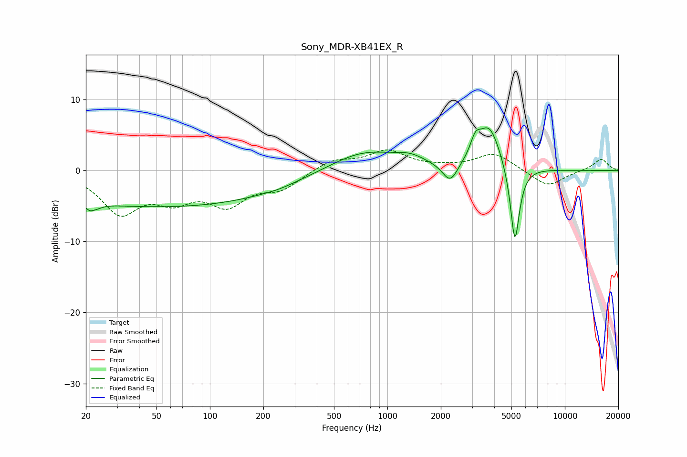

# Sony_MDR-XB41EX_R
See [usage instructions](https://github.com/jaakkopasanen/AutoEq#usage) for more options and info.

### Parametric EQs
Apply preamp of -6.1 dB when using parametric equalizer.

|   # | Type    |   Fc (Hz) |    Q |   Gain (dB) |
|-----|---------|-----------|------|-------------|
|   1 | Peaking |        22 | 5.16 |        -4.4 |
|   2 | Peaking |        22 | 5.95 |         3.2 |
|   3 | Peaking |        54 | 0.18 |        -5.1 |
|   4 | Peaking |       242 | 2.15 |        -0.2 |
|   5 | Peaking |       736 | 0.69 |         3.1 |
|   6 | Peaking |      1353 | 1.83 |         1   |
|   7 | Peaking |      2260 | 3.21 |        -2.9 |
|   8 | Peaking |      3131 | 5.23 |         2.1 |
|   9 | Peaking |      3742 | 2.12 |         6.3 |
|  10 | Peaking |      5229 | 5.29 |       -11.4 |

### Fixed Band EQs
When using fixed band (also called graphic) equalizer, apply preamp of **-3.0 dB** (if available) and set gains manually with these parameters.

|   # | Type    |   Fc (Hz) |    Q |   Gain (dB) |
|-----|---------|-----------|------|-------------|
|   1 | Peaking |        31 | 1.41 |        -5.6 |
|   2 | Peaking |        62 | 1.41 |        -3.3 |
|   3 | Peaking |       125 | 1.41 |        -4.3 |
|   4 | Peaking |       250 | 1.41 |        -2.3 |
|   5 | Peaking |       500 | 1.41 |         1.5 |
|   6 | Peaking |      1000 | 1.41 |         2.6 |
|   7 | Peaking |      2000 | 1.41 |         0.3 |
|   8 | Peaking |      4000 | 1.41 |         2.4 |
|   9 | Peaking |      8000 | 1.41 |        -2.3 |
|  10 | Peaking |     16000 | 1.41 |         1.7 |

### Graphs

