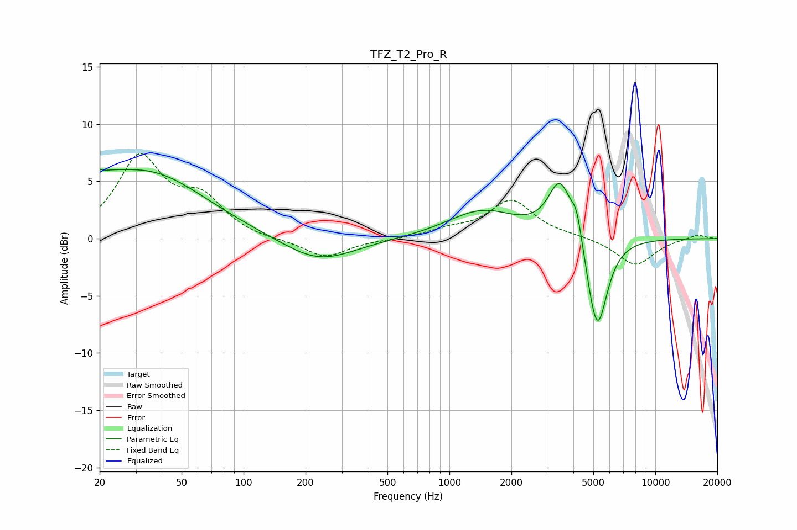

# TFZ_T2_Pro_R
See [usage instructions](https://github.com/jaakkopasanen/AutoEq#usage) for more options and info.

### Parametric EQs
Apply preamp of -6.1 dB when using parametric equalizer.

|   # | Type    |   Fc (Hz) |    Q |   Gain (dB) |
|-----|---------|-----------|------|-------------|
|   1 | Peaking |        20 | 1.46 |         1.5 |
|   2 | Peaking |        20 | 5.79 |         3.3 |
|   3 | Peaking |        21 | 5.85 |        -3   |
|   4 | Peaking |        35 | 0.51 |         5.6 |
|   5 | Peaking |       232 | 0.81 |        -2.1 |
|   6 | Peaking |      1442 | 0.84 |         2.4 |
|   7 | Peaking |      3443 | 2.46 |         4.9 |
|   8 | Peaking |      4155 | 5.17 |         2.3 |
|   9 | Peaking |      4873 | 3.79 |        -0.7 |
|  10 | Peaking |      5248 | 2.83 |        -8   |

### Fixed Band EQs
When using fixed band (also called graphic) equalizer, apply preamp of **-7.5 dB** (if available) and set gains manually with these parameters.

|   # | Type    |   Fc (Hz) |    Q |   Gain (dB) |
|-----|---------|-----------|------|-------------|
|   1 | Peaking |        31 | 1.41 |         6.9 |
|   2 | Peaking |        62 | 1.41 |         3.1 |
|   3 | Peaking |       125 | 1.41 |        -0.2 |
|   4 | Peaking |       250 | 1.41 |        -1.7 |
|   5 | Peaking |       500 | 1.41 |        -0.1 |
|   6 | Peaking |      1000 | 1.41 |         0.6 |
|   7 | Peaking |      2000 | 1.41 |         3.3 |
|   8 | Peaking |      4000 | 1.41 |         0.2 |
|   9 | Peaking |      8000 | 1.41 |        -2.4 |
|  10 | Peaking |     16000 | 1.41 |         0.4 |

### Graphs

