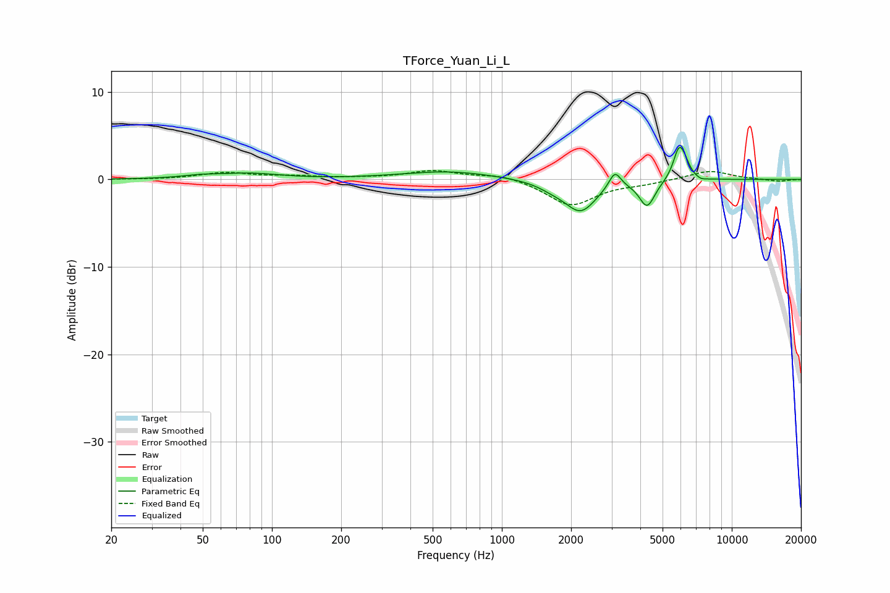

# TForce_Yuan_Li_L
See [usage instructions](https://github.com/jaakkopasanen/AutoEq#usage) for more options and info.

### Parametric EQs
Apply preamp of -3.8 dB when using parametric equalizer.

|   # | Type    |   Fc (Hz) |    Q |   Gain (dB) |
|-----|---------|-----------|------|-------------|
|   1 | Peaking |        48 | 1.88 |         0.3 |
|   2 | Peaking |        79 | 1.05 |         0.6 |
|   3 | Peaking |       583 | 0.71 |         0.9 |
|   4 | Peaking |      1657 | 2.17 |        -0.6 |
|   5 | Peaking |      2201 | 2.05 |        -3.5 |
|   6 | Peaking |      3100 | 5.42 |         2   |
|   7 | Peaking |      4284 | 4.14 |        -3   |
|   8 | Peaking |      5887 | 5.51 |         3.4 |
|   9 | Peaking |      6249 | 5.87 |         1.1 |
|  10 | Peaking |      7351 | 5.99 |        -0.3 |

### Fixed Band EQs
When using fixed band (also called graphic) equalizer, apply preamp of **-1.1 dB** (if available) and set gains manually with these parameters.

|   # | Type    |   Fc (Hz) |    Q |   Gain (dB) |
|-----|---------|-----------|------|-------------|
|   1 | Peaking |        31 | 1.41 |        -0   |
|   2 | Peaking |        62 | 1.41 |         0.7 |
|   3 | Peaking |       125 | 1.41 |         0.3 |
|   4 | Peaking |       250 | 1.41 |         0.1 |
|   5 | Peaking |       500 | 1.41 |         1   |
|   6 | Peaking |      1000 | 1.41 |         0.6 |
|   7 | Peaking |      2000 | 1.41 |        -3   |
|   8 | Peaking |      4000 | 1.41 |        -0.4 |
|   9 | Peaking |      8000 | 1.41 |         1   |
|  10 | Peaking |     16000 | 1.41 |        -0.2 |

### Graphs

