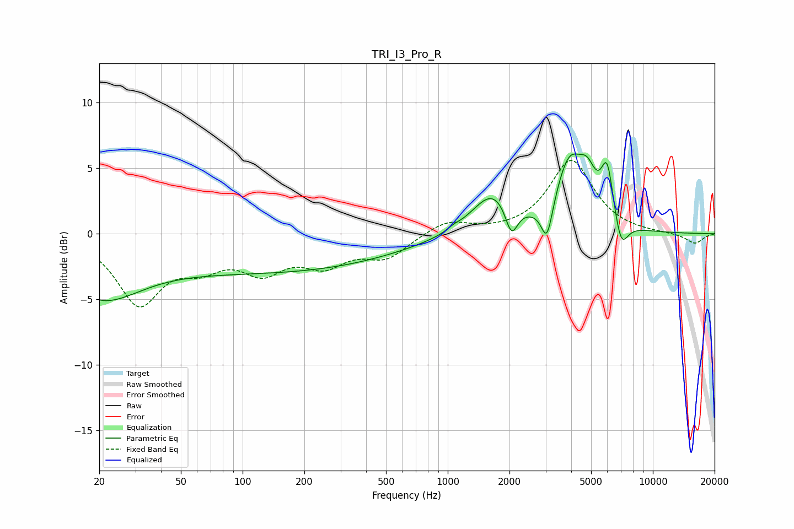

# TRI_I3_Pro_R
See [usage instructions](https://github.com/jaakkopasanen/AutoEq#usage) for more options and info.

### Parametric EQs
Apply preamp of -6.2 dB when using parametric equalizer.

|   # | Type    |   Fc (Hz) |    Q |   Gain (dB) |
|-----|---------|-----------|------|-------------|
|   1 | Peaking |        20 | 0.71 |        -4.2 |
|   2 | Peaking |       138 | 0.22 |        -2.8 |
|   3 | Peaking |      1068 | 5.04 |         0.2 |
|   4 | Peaking |      1659 | 1.39 |         3.2 |
|   5 | Peaking |      2044 | 4.67 |        -2.3 |
|   6 | Peaking |      3047 | 5.06 |        -3   |
|   7 | Peaking |      3916 | 2.06 |         5   |
|   8 | Peaking |      4803 | 3.24 |         2.5 |
|   9 | Peaking |      5991 | 4.51 |         4.2 |
|  10 | Peaking |      7000 | 4.14 |        -2.3 |

### Fixed Band EQs
When using fixed band (also called graphic) equalizer, apply preamp of **-5.7 dB** (if available) and set gains manually with these parameters.

|   # | Type    |   Fc (Hz) |    Q |   Gain (dB) |
|-----|---------|-----------|------|-------------|
|   1 | Peaking |        31 | 1.41 |        -5.1 |
|   2 | Peaking |        62 | 1.41 |        -1.9 |
|   3 | Peaking |       125 | 1.41 |        -2.5 |
|   4 | Peaking |       250 | 1.41 |        -2   |
|   5 | Peaking |       500 | 1.41 |        -1.7 |
|   6 | Peaking |      1000 | 1.41 |         1   |
|   7 | Peaking |      2000 | 1.41 |         0   |
|   8 | Peaking |      4000 | 1.41 |         5.6 |
|   9 | Peaking |      8000 | 1.41 |         0   |
|  10 | Peaking |     16000 | 1.41 |        -0.8 |

### Graphs

