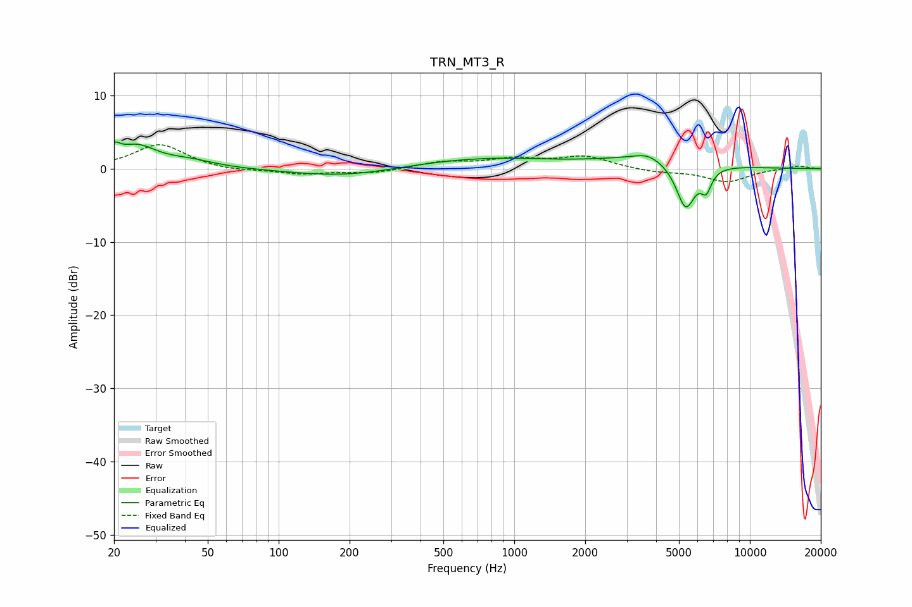

# TRN_MT3_R
See [usage instructions](https://github.com/jaakkopasanen/AutoEq#usage) for more options and info.

### Parametric EQs
Apply preamp of -3.8 dB when using parametric equalizer.

|   # | Type    |   Fc (Hz) |    Q |   Gain (dB) |
|-----|---------|-----------|------|-------------|
|   1 | Peaking |        20 | 5.55 |         1.7 |
|   2 | Peaking |        25 | 1.71 |         2.8 |
|   3 | Peaking |        42 | 1.31 |         0.9 |
|   4 | Peaking |       187 | 0.64 |        -1.1 |
|   5 | Peaking |       422 | 0.81 |         0.3 |
|   6 | Peaking |       810 | 0.57 |         1.2 |
|   7 | Peaking |      3680 | 2.44 |         0.9 |
|   8 | Peaking |      3720 | 0.59 |         1.4 |
|   9 | Peaking |      5341 | 3.39 |        -6.3 |
|  10 | Peaking |      6528 | 6    |        -2.7 |

### Fixed Band EQs
When using fixed band (also called graphic) equalizer, apply preamp of **-3.4 dB** (if available) and set gains manually with these parameters.

|   # | Type    |   Fc (Hz) |    Q |   Gain (dB) |
|-----|---------|-----------|------|-------------|
|   1 | Peaking |        31 | 1.41 |         3.4 |
|   2 | Peaking |        62 | 1.41 |        -0.4 |
|   3 | Peaking |       125 | 1.41 |        -0.7 |
|   4 | Peaking |       250 | 1.41 |        -0.6 |
|   5 | Peaking |       500 | 1.41 |         0.9 |
|   6 | Peaking |      1000 | 1.41 |         1.2 |
|   7 | Peaking |      2000 | 1.41 |         1.6 |
|   8 | Peaking |      4000 | 1.41 |        -0.5 |
|   9 | Peaking |      8000 | 1.41 |        -1.8 |
|  10 | Peaking |     16000 | 1.41 |         0.4 |

### Graphs

