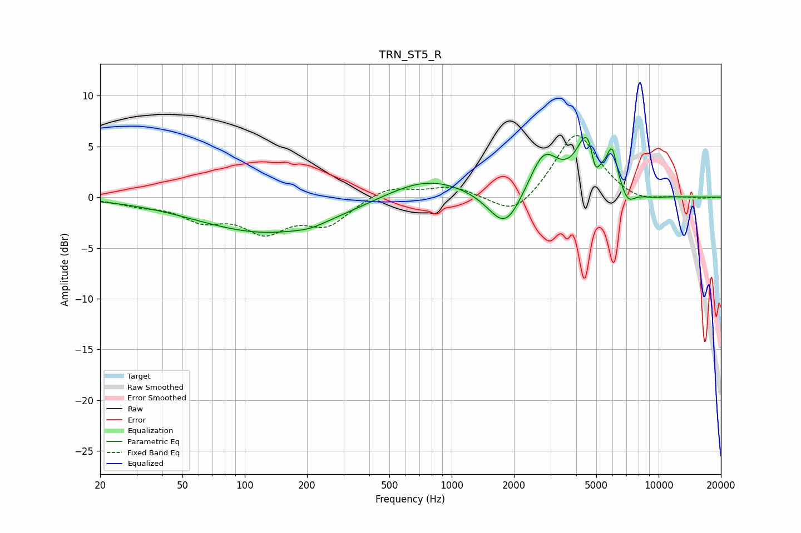

# TRN_ST5_R
See [usage instructions](https://github.com/jaakkopasanen/AutoEq#usage) for more options and info.

### Parametric EQs
Apply preamp of -6.0 dB when using parametric equalizer.

|   # | Type    |   Fc (Hz) |    Q |   Gain (dB) |
|-----|---------|-----------|------|-------------|
|   1 | Peaking |       130 | 0.41 |        -3.5 |
|   2 | Peaking |       207 | 2.01 |        -0.3 |
|   3 | Peaking |       758 | 0.7  |         2.1 |
|   4 | Peaking |      1814 | 1.76 |        -3.9 |
|   5 | Peaking |      2786 | 1.99 |         4.2 |
|   6 | Peaking |      4606 | 2.63 |         6.6 |
|   7 | Peaking |      4926 | 5.79 |        -3.4 |
|   8 | Peaking |      5964 | 5.71 |         3.3 |
|   9 | Peaking |      7100 | 3.95 |        -1.4 |
|  10 | Peaking |      9286 | 1.99 |        -0.2 |

### Fixed Band EQs
When using fixed band (also called graphic) equalizer, apply preamp of **-6.2 dB** (if available) and set gains manually with these parameters.

|   # | Type    |   Fc (Hz) |    Q |   Gain (dB) |
|-----|---------|-----------|------|-------------|
|   1 | Peaking |        31 | 1.41 |        -0.6 |
|   2 | Peaking |        62 | 1.41 |        -1.9 |
|   3 | Peaking |       125 | 1.41 |        -3   |
|   4 | Peaking |       250 | 1.41 |        -2.5 |
|   5 | Peaking |       500 | 1.41 |         1.1 |
|   6 | Peaking |      1000 | 1.41 |         1   |
|   7 | Peaking |      2000 | 1.41 |        -2.2 |
|   8 | Peaking |      4000 | 1.41 |         6.5 |
|   9 | Peaking |      8000 | 1.41 |        -0.7 |
|  10 | Peaking |     16000 | 1.41 |        -0.1 |

### Graphs

