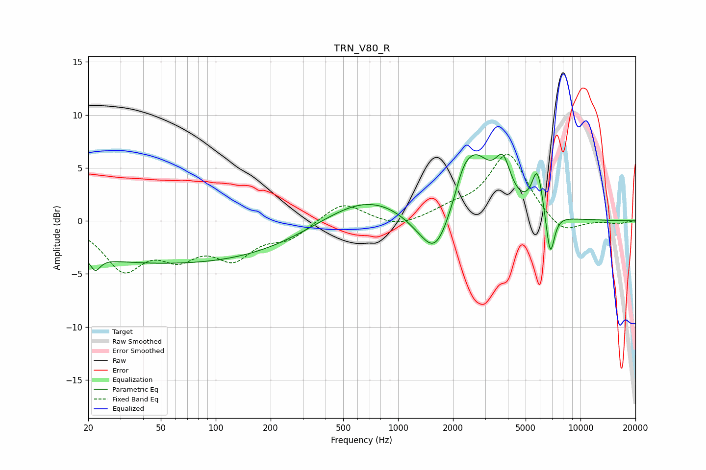

# TRN_V80_R
See [usage instructions](https://github.com/jaakkopasanen/AutoEq#usage) for more options and info.

### Parametric EQs
Apply preamp of -6.4 dB when using parametric equalizer.

|   # | Type    |   Fc (Hz) |    Q |   Gain (dB) |
|-----|---------|-----------|------|-------------|
|   1 | Peaking |        22 | 5.41 |        -1.3 |
|   2 | Peaking |        58 | 0.18 |        -4   |
|   3 | Peaking |       666 | 0.59 |         2.6 |
|   4 | Peaking |      1219 | 1.41 |        -0.6 |
|   5 | Peaking |      1605 | 1.67 |        -4.6 |
|   6 | Peaking |      2269 | 3.4  |         1.3 |
|   7 | Peaking |      2625 | 1.51 |         5.9 |
|   8 | Peaking |      3759 | 3.28 |         3.7 |
|   9 | Peaking |      5803 | 4.51 |         4.2 |
|  10 | Peaking |      6821 | 5.88 |        -4.4 |

### Fixed Band EQs
When using fixed band (also called graphic) equalizer, apply preamp of **-6.4 dB** (if available) and set gains manually with these parameters.

|   # | Type    |   Fc (Hz) |    Q |   Gain (dB) |
|-----|---------|-----------|------|-------------|
|   1 | Peaking |        31 | 1.41 |        -4.3 |
|   2 | Peaking |        62 | 1.41 |        -2.7 |
|   3 | Peaking |       125 | 1.41 |        -3.1 |
|   4 | Peaking |       250 | 1.41 |        -1.5 |
|   5 | Peaking |       500 | 1.41 |         1.9 |
|   6 | Peaking |      1000 | 1.41 |        -0.7 |
|   7 | Peaking |      2000 | 1.41 |         0.9 |
|   8 | Peaking |      4000 | 1.41 |         6.3 |
|   9 | Peaking |      8000 | 1.41 |        -1.5 |
|  10 | Peaking |     16000 | 1.41 |        -0.3 |

### Graphs

