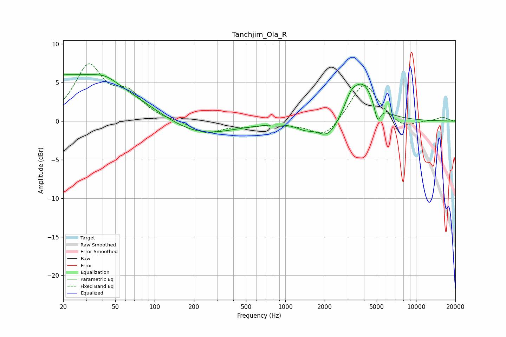

# Tanchjim_Ola_R
See [usage instructions](https://github.com/jaakkopasanen/AutoEq#usage) for more options and info.

### Parametric EQs
Apply preamp of -6.1 dB when using parametric equalizer.

|   # | Type    |   Fc (Hz) |    Q |   Gain (dB) |
|-----|---------|-----------|------|-------------|
|   1 | Peaking |        20 | 5.78 |        -3.3 |
|   2 | Peaking |        20 | 5.74 |         3.4 |
|   3 | Peaking |        24 | 0.28 |         5.9 |
|   4 | Peaking |        42 | 1.55 |         0.8 |
|   5 | Peaking |       213 | 0.55 |        -2.1 |
|   6 | Peaking |      1405 | 2.27 |        -0.7 |
|   7 | Peaking |      2114 | 1.73 |        -2.4 |
|   8 | Peaking |      3173 | 2.96 |         1.6 |
|   9 | Peaking |      3922 | 1.56 |         4.7 |
|  10 | Peaking |      5076 | 6    |        -2.4 |

### Fixed Band EQs
When using fixed band (also called graphic) equalizer, apply preamp of **-7.5 dB** (if available) and set gains manually with these parameters.

|   # | Type    |   Fc (Hz) |    Q |   Gain (dB) |
|-----|---------|-----------|------|-------------|
|   1 | Peaking |        31 | 1.41 |         6.9 |
|   2 | Peaking |        62 | 1.41 |         3.1 |
|   3 | Peaking |       125 | 1.41 |        -0   |
|   4 | Peaking |       250 | 1.41 |        -1.6 |
|   5 | Peaking |       500 | 1.41 |        -0.5 |
|   6 | Peaking |      1000 | 1.41 |        -0.4 |
|   7 | Peaking |      2000 | 1.41 |        -2.2 |
|   8 | Peaking |      4000 | 1.41 |         5.2 |
|   9 | Peaking |      8000 | 1.41 |        -1.1 |
|  10 | Peaking |     16000 | 1.41 |         0.5 |

### Graphs

