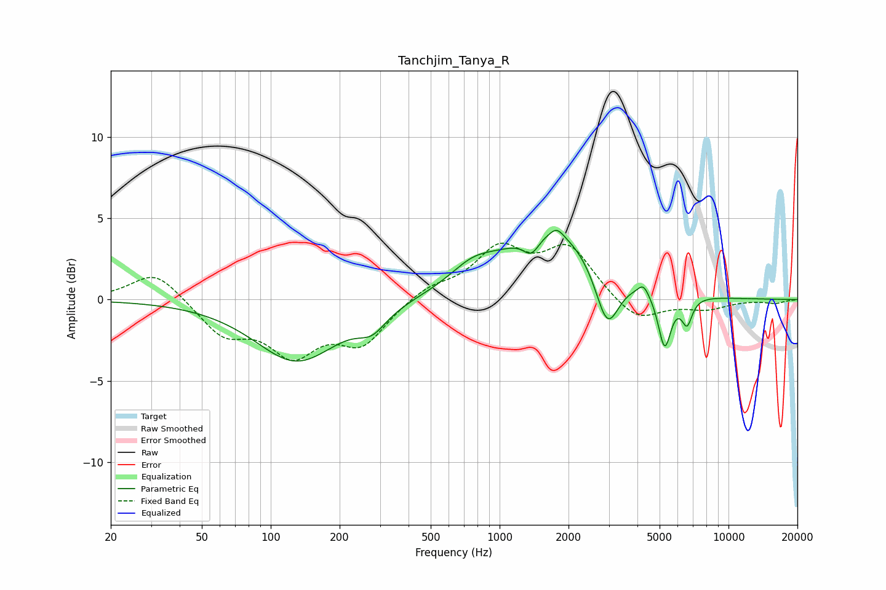

# Tanchjim_Tanya_R
See [usage instructions](https://github.com/jaakkopasanen/AutoEq#usage) for more options and info.

### Parametric EQs
Apply preamp of -4.4 dB when using parametric equalizer.

|   # | Type    |   Fc (Hz) |    Q |   Gain (dB) |
|-----|---------|-----------|------|-------------|
|   1 | Peaking |       130 | 0.78 |        -3.8 |
|   2 | Peaking |       277 | 2.26 |        -1.1 |
|   3 | Peaking |       764 | 1.39 |         1.2 |
|   4 | Peaking |      1377 | 3.92 |        -1.1 |
|   5 | Peaking |      1723 | 0.69 |         4.3 |
|   6 | Peaking |      1778 | 5.18 |         0.5 |
|   7 | Peaking |      2954 | 2.7  |        -3.7 |
|   8 | Peaking |      4253 | 6    |         0.7 |
|   9 | Peaking |      5260 | 4.95 |        -3.4 |
|  10 | Peaking |      6587 | 6    |        -1.6 |

### Fixed Band EQs
When using fixed band (also called graphic) equalizer, apply preamp of **-3.6 dB** (if available) and set gains manually with these parameters.

|   # | Type    |   Fc (Hz) |    Q |   Gain (dB) |
|-----|---------|-----------|------|-------------|
|   1 | Peaking |        31 | 1.41 |         1.8 |
|   2 | Peaking |        62 | 1.41 |        -2   |
|   3 | Peaking |       125 | 1.41 |        -3   |
|   4 | Peaking |       250 | 1.41 |        -2.5 |
|   5 | Peaking |       500 | 1.41 |         0.8 |
|   6 | Peaking |      1000 | 1.41 |         2.9 |
|   7 | Peaking |      2000 | 1.41 |         3.1 |
|   8 | Peaking |      4000 | 1.41 |        -1.5 |
|   9 | Peaking |      8000 | 1.41 |        -0.5 |
|  10 | Peaking |     16000 | 1.41 |        -0.2 |

### Graphs

