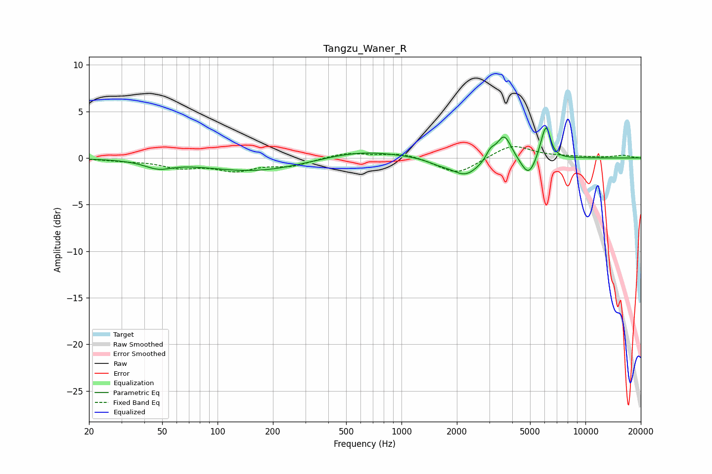

# Tangzu_Waner_R
See [usage instructions](https://github.com/jaakkopasanen/AutoEq#usage) for more options and info.

### Parametric EQs
Apply preamp of -3.3 dB when using parametric equalizer.

|   # | Type    |   Fc (Hz) |    Q |   Gain (dB) |
|-----|---------|-----------|------|-------------|
|   1 | Peaking |        48 | 1.92 |        -0.8 |
|   2 | Peaking |       160 | 0.51 |        -1.4 |
|   3 | Peaking |       593 | 0.66 |         0.9 |
|   4 | Peaking |      1587 | 2.34 |        -0.4 |
|   5 | Peaking |      2229 | 1.83 |        -1.9 |
|   6 | Peaking |      3049 | 6    |         0.9 |
|   7 | Peaking |      3614 | 3.59 |         2.7 |
|   8 | Peaking |      4902 | 3.43 |        -2.1 |
|   9 | Peaking |      5778 | 5.49 |         0.8 |
|  10 | Peaking |      6133 | 6    |         3.2 |

### Fixed Band EQs
When using fixed band (also called graphic) equalizer, apply preamp of **-1.3 dB** (if available) and set gains manually with these parameters.

|   # | Type    |   Fc (Hz) |    Q |   Gain (dB) |
|-----|---------|-----------|------|-------------|
|   1 | Peaking |        31 | 1.41 |        -0.2 |
|   2 | Peaking |        62 | 1.41 |        -0.9 |
|   3 | Peaking |       125 | 1.41 |        -1.2 |
|   4 | Peaking |       250 | 1.41 |        -0.8 |
|   5 | Peaking |       500 | 1.41 |         0.6 |
|   6 | Peaking |      1000 | 1.41 |         0.6 |
|   7 | Peaking |      2000 | 1.41 |        -1.8 |
|   8 | Peaking |      4000 | 1.41 |         1.5 |
|   9 | Peaking |      8000 | 1.41 |         0.1 |
|  10 | Peaking |     16000 | 1.41 |         0.3 |

### Graphs

