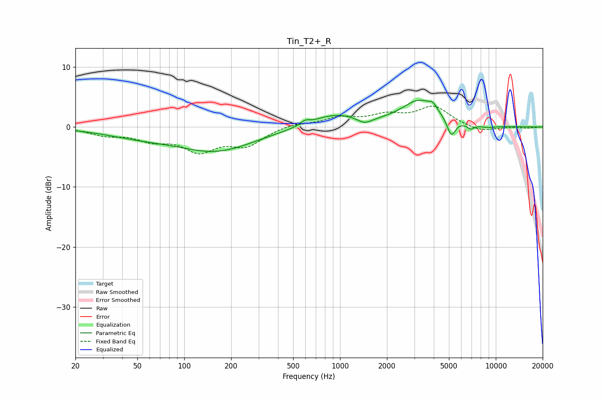

# Tin_T2+_R
See [usage instructions](https://github.com/jaakkopasanen/AutoEq#usage) for more options and info.

### Parametric EQs
Apply preamp of -4.6 dB when using parametric equalizer.

|   # | Type    |   Fc (Hz) |    Q |   Gain (dB) |
|-----|---------|-----------|------|-------------|
|   1 | Peaking |        50 | 0.63 |        -1.2 |
|   2 | Peaking |       160 | 0.57 |        -3.8 |
|   3 | Peaking |       596 | 5.04 |         0.7 |
|   4 | Peaking |       925 | 0.93 |         2.1 |
|   5 | Peaking |      1440 | 3.04 |        -1   |
|   6 | Peaking |      3256 | 1.2  |         4.3 |
|   7 | Peaking |      3951 | 6    |         0.9 |
|   8 | Peaking |      5176 | 5.05 |        -3   |
|   9 | Peaking |      6891 | 6    |        -0.8 |
|  10 | Peaking |      8836 | 2.3  |        -0.3 |

### Fixed Band EQs
When using fixed band (also called graphic) equalizer, apply preamp of **-3.6 dB** (if available) and set gains manually with these parameters.

|   # | Type    |   Fc (Hz) |    Q |   Gain (dB) |
|-----|---------|-----------|------|-------------|
|   1 | Peaking |        31 | 1.41 |        -1.2 |
|   2 | Peaking |        62 | 1.41 |        -1.8 |
|   3 | Peaking |       125 | 1.41 |        -3.6 |
|   4 | Peaking |       250 | 1.41 |        -2.8 |
|   5 | Peaking |       500 | 1.41 |         0.6 |
|   6 | Peaking |      1000 | 1.41 |         1.4 |
|   7 | Peaking |      2000 | 1.41 |         1.7 |
|   8 | Peaking |      4000 | 1.41 |         3.3 |
|   9 | Peaking |      8000 | 1.41 |        -0.9 |
|  10 | Peaking |     16000 | 1.41 |        -0.2 |

### Graphs

