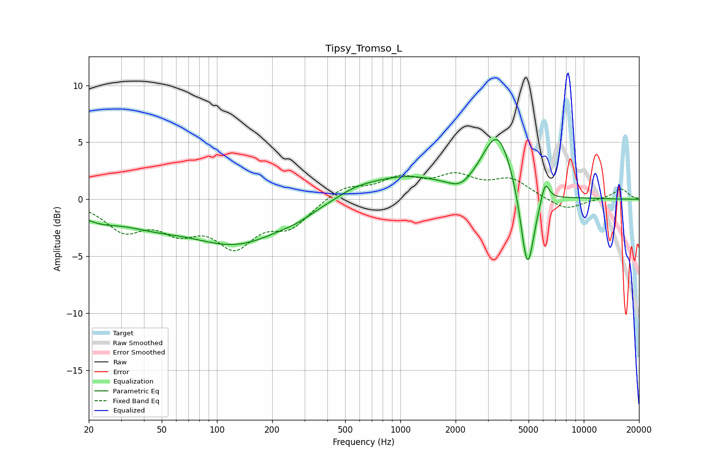

# Tipsy_Tromso_L
See [usage instructions](https://github.com/jaakkopasanen/AutoEq#usage) for more options and info.

### Parametric EQs
Apply preamp of -5.3 dB when using parametric equalizer.

|   # | Type    |   Fc (Hz) |    Q |   Gain (dB) |
|-----|---------|-----------|------|-------------|
|   1 | Peaking |        22 | 1.2  |        -1.2 |
|   2 | Peaking |        44 | 0.79 |        -1.3 |
|   3 | Peaking |       129 | 0.53 |        -3.7 |
|   4 | Peaking |       274 | 1.75 |        -0.3 |
|   5 | Peaking |       565 | 1.32 |         0.6 |
|   6 | Peaking |      1040 | 0.64 |         1.9 |
|   7 | Peaking |      2139 | 2.14 |        -1   |
|   8 | Peaking |      3394 | 1.62 |         5.8 |
|   9 | Peaking |      4928 | 3.72 |        -7.8 |
|  10 | Peaking |      6154 | 6    |         1.9 |

### Fixed Band EQs
When using fixed band (also called graphic) equalizer, apply preamp of **-2.4 dB** (if available) and set gains manually with these parameters.

|   # | Type    |   Fc (Hz) |    Q |   Gain (dB) |
|-----|---------|-----------|------|-------------|
|   1 | Peaking |        31 | 1.41 |        -2.5 |
|   2 | Peaking |        62 | 1.41 |        -2.3 |
|   3 | Peaking |       125 | 1.41 |        -3.7 |
|   4 | Peaking |       250 | 1.41 |        -2.2 |
|   5 | Peaking |       500 | 1.41 |         1.1 |
|   6 | Peaking |      1000 | 1.41 |         1.6 |
|   7 | Peaking |      2000 | 1.41 |         1.8 |
|   8 | Peaking |      4000 | 1.41 |         1.6 |
|   9 | Peaking |      8000 | 1.41 |        -1   |
|  10 | Peaking |     16000 | 1.41 |         0.9 |

### Graphs

