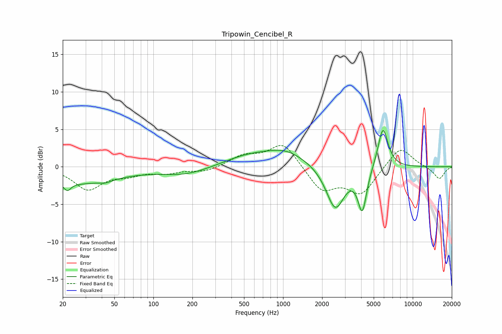

# Tripowin_Cencibel_R
See [usage instructions](https://github.com/jaakkopasanen/AutoEq#usage) for more options and info.

### Parametric EQs
Apply preamp of -4.9 dB when using parametric equalizer.

|   # | Type    |   Fc (Hz) |    Q |   Gain (dB) |
|-----|---------|-----------|------|-------------|
|   1 | Peaking |        22 | 5.48 |        -1   |
|   2 | Peaking |        24 | 0.43 |        -2.2 |
|   3 | Peaking |        43 | 3.06 |        -0.3 |
|   4 | Peaking |       177 | 0.78 |        -1   |
|   5 | Peaking |       516 | 0.78 |         1.2 |
|   6 | Peaking |      1037 | 0.85 |         2   |
|   7 | Peaking |      2526 | 2    |        -5.8 |
|   8 | Peaking |      4056 | 5.4  |         0.8 |
|   9 | Peaking |      4078 | 4.32 |        -6.4 |
|  10 | Peaking |      5891 | 3.48 |         5.6 |

### Fixed Band EQs
When using fixed band (also called graphic) equalizer, apply preamp of **-2.9 dB** (if available) and set gains manually with these parameters.

|   # | Type    |   Fc (Hz) |    Q |   Gain (dB) |
|-----|---------|-----------|------|-------------|
|   1 | Peaking |        31 | 1.41 |        -2.9 |
|   2 | Peaking |        62 | 1.41 |        -0.9 |
|   3 | Peaking |       125 | 1.41 |        -0.7 |
|   4 | Peaking |       250 | 1.41 |        -0.7 |
|   5 | Peaking |       500 | 1.41 |         1.4 |
|   6 | Peaking |      1000 | 1.41 |         3.2 |
|   7 | Peaking |      2000 | 1.41 |        -3.2 |
|   8 | Peaking |      4000 | 1.41 |        -3.5 |
|   9 | Peaking |      8000 | 1.41 |         2.8 |
|  10 | Peaking |     16000 | 1.41 |        -1.7 |

### Graphs

