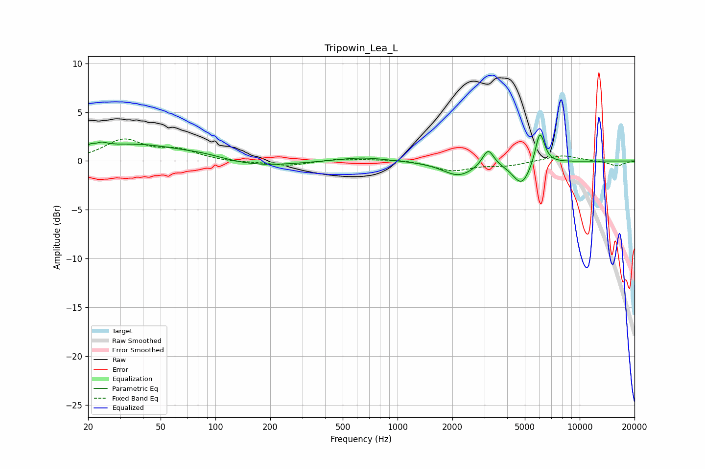

# Tripowin_Lea_L
See [usage instructions](https://github.com/jaakkopasanen/AutoEq#usage) for more options and info.

### Parametric EQs
Apply preamp of -2.8 dB when using parametric equalizer.

|   # | Type    |   Fc (Hz) |    Q |   Gain (dB) |
|-----|---------|-----------|------|-------------|
|   1 | Peaking |        22 | 4.06 |         1.9 |
|   2 | Peaking |        22 | 5.57 |        -1.3 |
|   3 | Peaking |        37 | 0.55 |         1.7 |
|   4 | Peaking |        87 | 1.23 |         0.3 |
|   5 | Peaking |       167 | 0.68 |        -0.6 |
|   6 | Peaking |       637 | 1.08 |         0.4 |
|   7 | Peaking |      2162 | 1.61 |        -1.5 |
|   8 | Peaking |      3144 | 4.6  |         1.8 |
|   9 | Peaking |      4809 | 2.76 |        -2.4 |
|  10 | Peaking |      6047 | 5.3  |         3.5 |

### Fixed Band EQs
When using fixed band (also called graphic) equalizer, apply preamp of **-2.4 dB** (if available) and set gains manually with these parameters.

|   # | Type    |   Fc (Hz) |    Q |   Gain (dB) |
|-----|---------|-----------|------|-------------|
|   1 | Peaking |        31 | 1.41 |         2.1 |
|   2 | Peaking |        62 | 1.41 |         1   |
|   3 | Peaking |       125 | 1.41 |        -0.2 |
|   4 | Peaking |       250 | 1.41 |        -0.5 |
|   5 | Peaking |       500 | 1.41 |         0.3 |
|   6 | Peaking |      1000 | 1.41 |         0.2 |
|   7 | Peaking |      2000 | 1.41 |        -1   |
|   8 | Peaking |      4000 | 1.41 |        -0.4 |
|   9 | Peaking |      8000 | 1.41 |         0.6 |
|  10 | Peaking |     16000 | 1.41 |        -0.5 |

### Graphs

