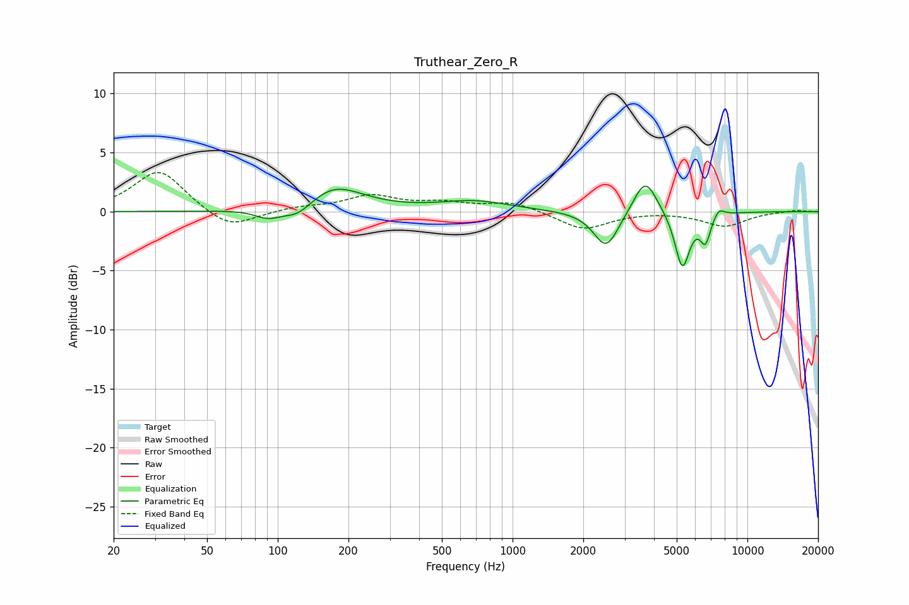

# Truthear_Zero_R
See [usage instructions](https://github.com/jaakkopasanen/AutoEq#usage) for more options and info.

### Parametric EQs
Apply preamp of -2.3 dB when using parametric equalizer.

|   # | Type    |   Fc (Hz) |    Q |   Gain (dB) |
|-----|---------|-----------|------|-------------|
|   1 | Peaking |        91 | 2.45 |        -0.8 |
|   2 | Peaking |       122 | 2.36 |        -1.1 |
|   3 | Peaking |       173 | 2.34 |         0.2 |
|   4 | Peaking |       176 | 1.07 |         1.9 |
|   5 | Peaking |       689 | 0.93 |         0.8 |
|   6 | Peaking |      2506 | 2.66 |        -3.2 |
|   7 | Peaking |      3672 | 2.84 |         3.1 |
|   8 | Peaking |      5283 | 4.36 |        -4.8 |
|   9 | Peaking |      6626 | 6    |        -2.3 |
|  10 | Peaking |      7542 | 5.67 |         0.7 |

### Fixed Band EQs
When using fixed band (also called graphic) equalizer, apply preamp of **-3.4 dB** (if available) and set gains manually with these parameters.

|   # | Type    |   Fc (Hz) |    Q |   Gain (dB) |
|-----|---------|-----------|------|-------------|
|   1 | Peaking |        31 | 1.41 |         3.6 |
|   2 | Peaking |        62 | 1.41 |        -1.6 |
|   3 | Peaking |       125 | 1.41 |         0.3 |
|   4 | Peaking |       250 | 1.41 |         1.3 |
|   5 | Peaking |       500 | 1.41 |         0.6 |
|   6 | Peaking |      1000 | 1.41 |         0.8 |
|   7 | Peaking |      2000 | 1.41 |        -1.5 |
|   8 | Peaking |      4000 | 1.41 |         0.1 |
|   9 | Peaking |      8000 | 1.41 |        -1.2 |
|  10 | Peaking |     16000 | 1.41 |         0.1 |

### Graphs

