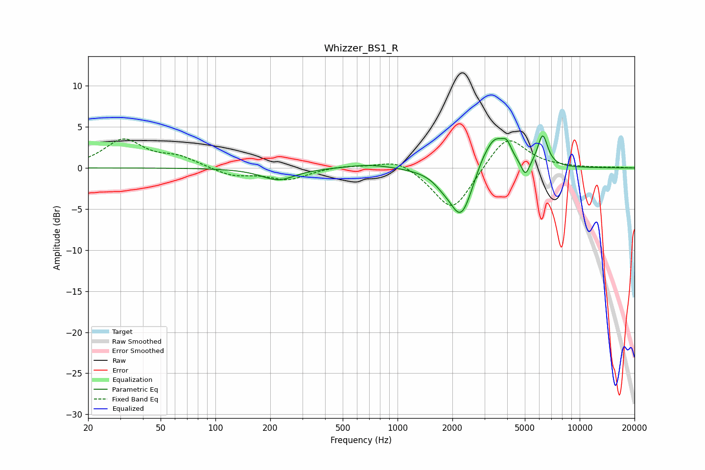

# Whizzer_BS1_R
See [usage instructions](https://github.com/jaakkopasanen/AutoEq#usage) for more options and info.

### Parametric EQs
Apply preamp of -4.0 dB when using parametric equalizer.

|   # | Type    |   Fc (Hz) |    Q |   Gain (dB) |
|-----|---------|-----------|------|-------------|
|   1 | Peaking |       221 | 1.54 |        -1.5 |
|   2 | Peaking |       710 | 1.11 |         0.5 |
|   3 | Peaking |      1753 | 3.14 |        -0.6 |
|   4 | Peaking |      2221 | 1.56 |        -1   |
|   5 | Peaking |      2232 | 2.3  |        -5.3 |
|   6 | Peaking |      2875 | 3.83 |         0.6 |
|   7 | Peaking |      3408 | 2.14 |         4.3 |
|   8 | Peaking |      3986 | 5.85 |         1.3 |
|   9 | Peaking |      5031 | 6    |        -1.9 |
|  10 | Peaking |      6264 | 4.95 |         3.8 |

### Fixed Band EQs
When using fixed band (also called graphic) equalizer, apply preamp of **-3.6 dB** (if available) and set gains manually with these parameters.

|   # | Type    |   Fc (Hz) |    Q |   Gain (dB) |
|-----|---------|-----------|------|-------------|
|   1 | Peaking |        31 | 1.41 |         3.3 |
|   2 | Peaking |        62 | 1.41 |         1.2 |
|   3 | Peaking |       125 | 1.41 |        -1   |
|   4 | Peaking |       250 | 1.41 |        -1.4 |
|   5 | Peaking |       500 | 1.41 |         0.3 |
|   6 | Peaking |      1000 | 1.41 |         1.2 |
|   7 | Peaking |      2000 | 1.41 |        -5.5 |
|   8 | Peaking |      4000 | 1.41 |         4.2 |
|   9 | Peaking |      8000 | 1.41 |         0.1 |
|  10 | Peaking |     16000 | 1.41 |         0.1 |

### Graphs

