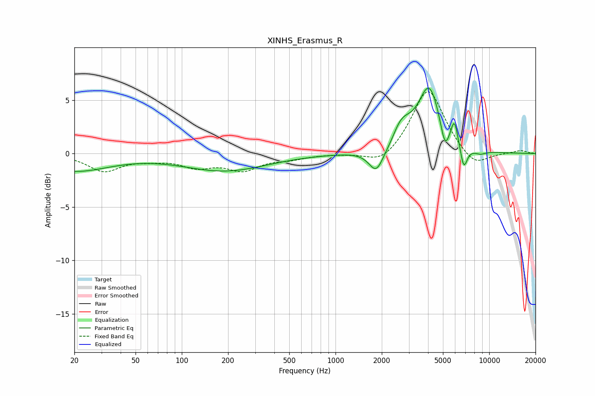

# XINHS_Erasmus_R
See [usage instructions](https://github.com/jaakkopasanen/AutoEq#usage) for more options and info.

### Parametric EQs
Apply preamp of -6.2 dB when using parametric equalizer.

|   # | Type    |   Fc (Hz) |    Q |   Gain (dB) |
|-----|---------|-----------|------|-------------|
|   1 | Peaking |        20 | 0.62 |        -1.6 |
|   2 | Peaking |       191 | 0.52 |        -1.6 |
|   3 | Peaking |      1844 | 2.9  |        -2.3 |
|   4 | Peaking |      2349 | 2.5  |        -0.8 |
|   5 | Peaking |      2639 | 2.05 |         2.7 |
|   6 | Peaking |      4075 | 1.95 |         6   |
|   7 | Peaking |      5151 | 4.92 |        -2.2 |
|   8 | Peaking |      5934 | 5.99 |         2.2 |
|   9 | Peaking |      6827 | 5.84 |        -2.2 |
|  10 | Peaking |      8715 | 3.33 |        -0.3 |

### Fixed Band EQs
When using fixed band (also called graphic) equalizer, apply preamp of **-5.9 dB** (if available) and set gains manually with these parameters.

|   # | Type    |   Fc (Hz) |    Q |   Gain (dB) |
|-----|---------|-----------|------|-------------|
|   1 | Peaking |        31 | 1.41 |        -1.6 |
|   2 | Peaking |        62 | 1.41 |        -0.4 |
|   3 | Peaking |       125 | 1.41 |        -1.1 |
|   4 | Peaking |       250 | 1.41 |        -1.4 |
|   5 | Peaking |       500 | 1.41 |        -0.4 |
|   6 | Peaking |      1000 | 1.41 |        -0   |
|   7 | Peaking |      2000 | 1.41 |        -1.2 |
|   8 | Peaking |      4000 | 1.41 |         6.2 |
|   9 | Peaking |      8000 | 1.41 |        -1.5 |
|  10 | Peaking |     16000 | 1.41 |         0.3 |

### Graphs

