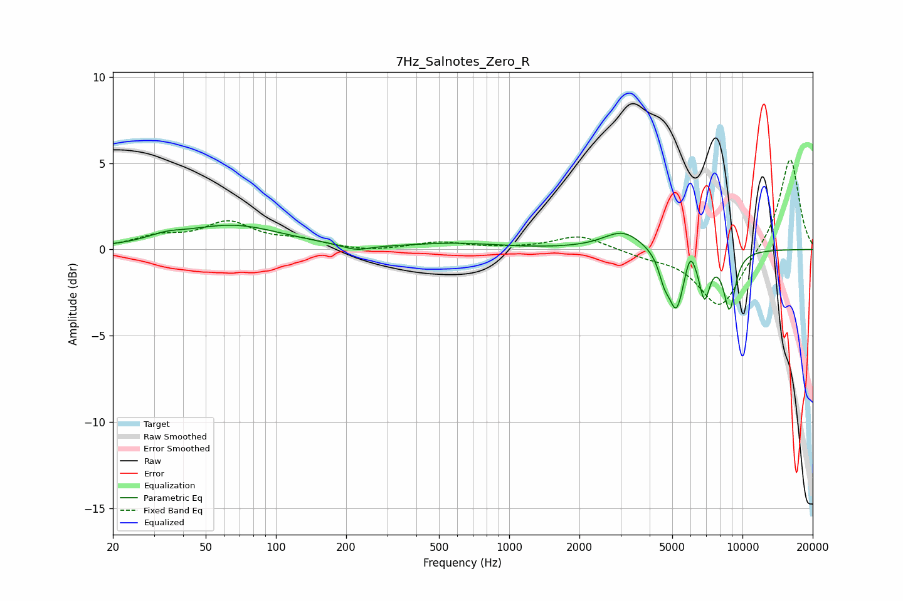

# 7Hz_Salnotes_Zero_R
See [usage instructions](https://github.com/jaakkopasanen/AutoEq#usage) for more options and info.

### Parametric EQs
Apply preamp of -1.5 dB when using parametric equalizer.

|   # | Type    |   Fc (Hz) |    Q |   Gain (dB) |
|-----|---------|-----------|------|-------------|
|   1 | Peaking |        34 | 1.86 |         0.3 |
|   2 | Peaking |        65 | 0.67 |         1.4 |
|   3 | Peaking |       221 | 2.4  |        -0.3 |
|   4 | Peaking |       588 | 0.76 |         0.3 |
|   5 | Peaking |      3078 | 1.67 |         1.1 |
|   6 | Peaking |      4619 | 5.96 |        -1.1 |
|   7 | Peaking |      5213 | 4.23 |        -3.3 |
|   8 | Peaking |      5963 | 5.99 |         1.2 |
|   9 | Peaking |      6873 | 5.85 |        -2.5 |
|  10 | Peaking |      8799 | 5.06 |        -3.3 |

### Fixed Band EQs
When using fixed band (also called graphic) equalizer, apply preamp of **-5.3 dB** (if available) and set gains manually with these parameters.

|   # | Type    |   Fc (Hz) |    Q |   Gain (dB) |
|-----|---------|-----------|------|-------------|
|   1 | Peaking |        31 | 1.41 |         0.7 |
|   2 | Peaking |        62 | 1.41 |         1.5 |
|   3 | Peaking |       125 | 1.41 |         0.5 |
|   4 | Peaking |       250 | 1.41 |        -0.2 |
|   5 | Peaking |       500 | 1.41 |         0.4 |
|   6 | Peaking |      1000 | 1.41 |         0   |
|   7 | Peaking |      2000 | 1.41 |         0.8 |
|   8 | Peaking |      4000 | 1.41 |        -0.3 |
|   9 | Peaking |      8000 | 1.41 |        -3.4 |
|  10 | Peaking |     16000 | 1.41 |         5.4 |

### Graphs

