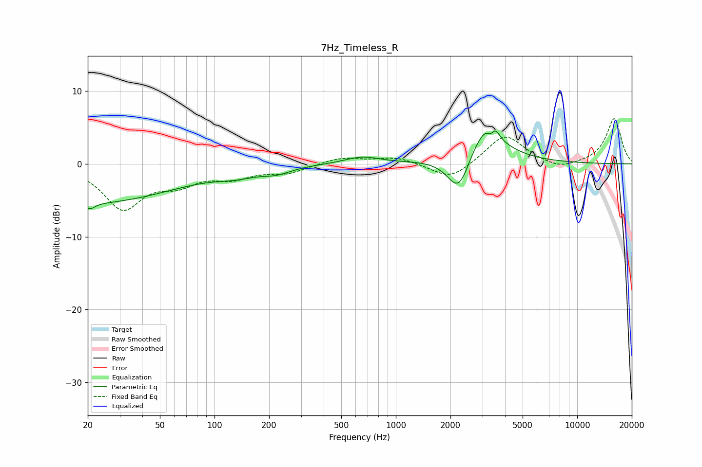

# 7Hz_Timeless_R
See [usage instructions](https://github.com/jaakkopasanen/AutoEq#usage) for more options and info.

### Parametric EQs
Apply preamp of -4.6 dB when using parametric equalizer.

|   # | Type    |   Fc (Hz) |    Q |   Gain (dB) |
|-----|---------|-----------|------|-------------|
|   1 | Peaking |        21 | 0.29 |        -5.3 |
|   2 | Peaking |        21 | 5.35 |        -0.8 |
|   3 | Peaking |       132 | 1.28 |        -0.8 |
|   4 | Peaking |       220 | 1.78 |        -0.8 |
|   5 | Peaking |       652 | 1.46 |         1   |
|   6 | Peaking |      2233 | 2.11 |        -6.3 |
|   7 | Peaking |      2960 | 1.15 |         5.2 |
|   8 | Peaking |      3217 | 3.6  |         2.4 |
|   9 | Peaking |      3366 | 4.52 |        -3   |
|  10 | Peaking |      3510 | 5.78 |         2.3 |

### Fixed Band EQs
When using fixed band (also called graphic) equalizer, apply preamp of **-6.3 dB** (if available) and set gains manually with these parameters.

|   # | Type    |   Fc (Hz) |    Q |   Gain (dB) |
|-----|---------|-----------|------|-------------|
|   1 | Peaking |        31 | 1.41 |        -5.9 |
|   2 | Peaking |        62 | 1.41 |        -2.2 |
|   3 | Peaking |       125 | 1.41 |        -1.6 |
|   4 | Peaking |       250 | 1.41 |        -1.1 |
|   5 | Peaking |       500 | 1.41 |         0.9 |
|   6 | Peaking |      1000 | 1.41 |         0.9 |
|   7 | Peaking |      2000 | 1.41 |        -2.3 |
|   8 | Peaking |      4000 | 1.41 |         4.1 |
|   9 | Peaking |      8000 | 1.41 |        -0.9 |
|  10 | Peaking |     16000 | 1.41 |         6.2 |

### Graphs

