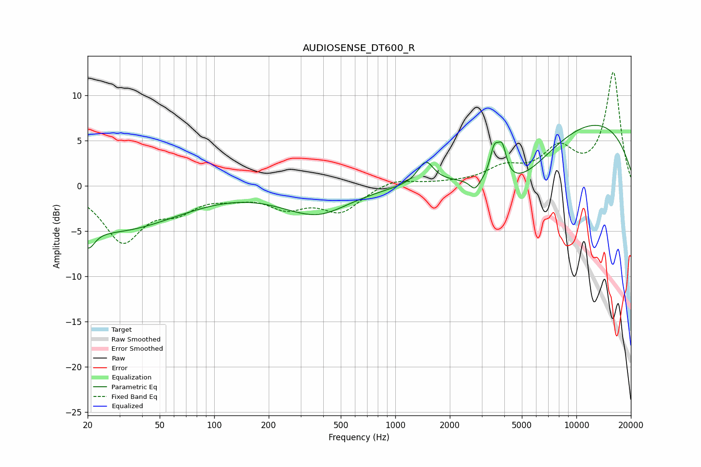

# AUDIOSENSE_DT600_R
See [usage instructions](https://github.com/jaakkopasanen/AutoEq#usage) for more options and info.

### Parametric EQs
Apply preamp of -6.8 dB when using parametric equalizer.

|   # | Type    |   Fc (Hz) |    Q |   Gain (dB) |
|-----|---------|-----------|------|-------------|
|   1 | Peaking |        20 | 3.89 |        -2.4 |
|   2 | Peaking |        28 | 0.4  |        -4.8 |
|   3 | Peaking |       313 | 2.11 |         0.1 |
|   4 | Peaking |       361 | 0.78 |        -3.1 |
|   5 | Peaking |      1473 | 3.29 |         2.5 |
|   6 | Peaking |      2749 | 5.26 |        -1.2 |
|   7 | Peaking |      3521 | 5.66 |         3.3 |
|   8 | Peaking |      3897 | 5.94 |         3.2 |
|   9 | Peaking |      4711 | 0.64 |        -5.4 |
|  10 | Peaking |     10000 | 0.26 |         8   |

### Fixed Band EQs
When using fixed band (also called graphic) equalizer, apply preamp of **-12.6 dB** (if available) and set gains manually with these parameters.

|   # | Type    |   Fc (Hz) |    Q |   Gain (dB) |
|-----|---------|-----------|------|-------------|
|   1 | Peaking |        31 | 1.41 |        -5.9 |
|   2 | Peaking |        62 | 1.41 |        -2.2 |
|   3 | Peaking |       125 | 1.41 |        -0.8 |
|   4 | Peaking |       250 | 1.41 |        -2.1 |
|   5 | Peaking |       500 | 1.41 |        -2.7 |
|   6 | Peaking |      1000 | 1.41 |         0.8 |
|   7 | Peaking |      2000 | 1.41 |         0.2 |
|   8 | Peaking |      4000 | 1.41 |         1.8 |
|   9 | Peaking |      8000 | 1.41 |         3.7 |
|  10 | Peaking |     16000 | 1.41 |        12.4 |

### Graphs

