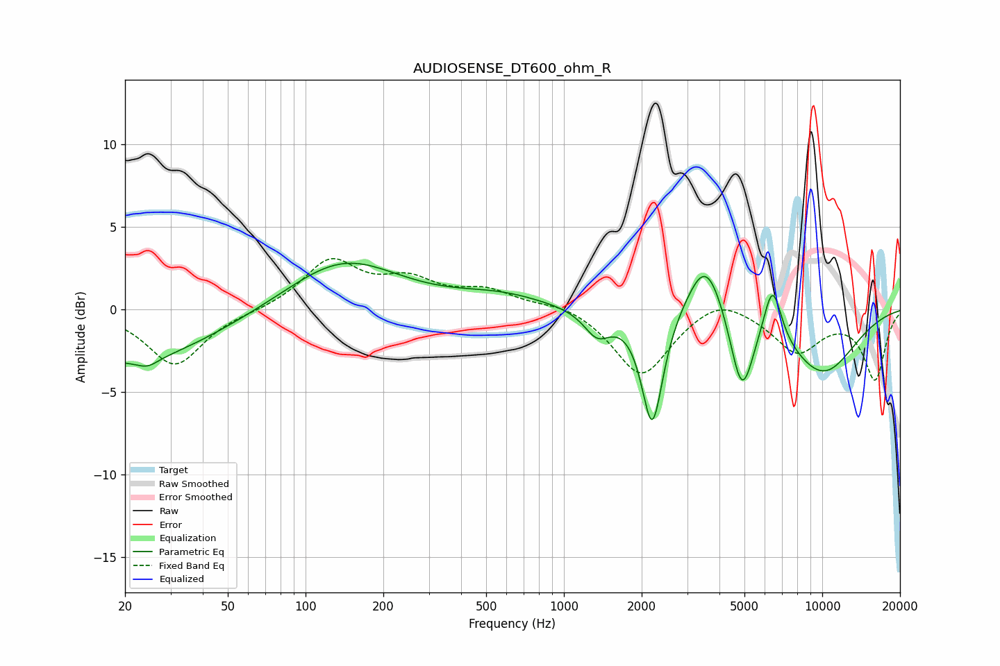

# AUDIOSENSE_DT600_ohm_R
See [usage instructions](https://github.com/jaakkopasanen/AutoEq#usage) for more options and info.

### Parametric EQs
Apply preamp of -2.9 dB when using parametric equalizer.

|   # | Type    |   Fc (Hz) |    Q |   Gain (dB) |
|-----|---------|-----------|------|-------------|
|   1 | Peaking |        21 | 0.43 |        -3.2 |
|   2 | Peaking |        24 | 3.52 |        -0.5 |
|   3 | Peaking |       140 | 0.67 |         3.1 |
|   4 | Peaking |       566 | 0.83 |         0.8 |
|   5 | Peaking |      1346 | 2.77 |        -1.5 |
|   6 | Peaking |      2198 | 3.43 |        -7.1 |
|   7 | Peaking |      3547 | 1.96 |         3.8 |
|   8 | Peaking |      4885 | 3.08 |        -4.9 |
|   9 | Peaking |      6421 | 3.92 |         3.4 |
|  10 | Peaking |     10000 | 0.86 |        -3.8 |

### Fixed Band EQs
When using fixed band (also called graphic) equalizer, apply preamp of **-3.2 dB** (if available) and set gains manually with these parameters.

|   # | Type    |   Fc (Hz) |    Q |   Gain (dB) |
|-----|---------|-----------|------|-------------|
|   1 | Peaking |        31 | 1.41 |        -3.4 |
|   2 | Peaking |        62 | 1.41 |        -0.1 |
|   3 | Peaking |       125 | 1.41 |         2.9 |
|   4 | Peaking |       250 | 1.41 |         1.5 |
|   5 | Peaking |       500 | 1.41 |         1   |
|   6 | Peaking |      1000 | 1.41 |         0.4 |
|   7 | Peaking |      2000 | 1.41 |        -4.1 |
|   8 | Peaking |      4000 | 1.41 |         1   |
|   9 | Peaking |      8000 | 1.41 |        -2.5 |
|  10 | Peaking |     16000 | 1.41 |        -4.2 |

### Graphs

