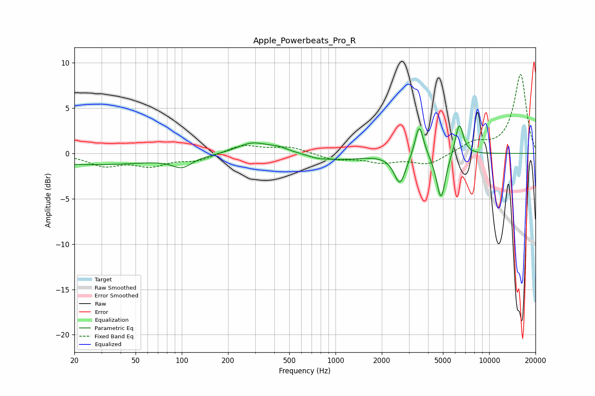

# Apple_Powerbeats_Pro_R
See [usage instructions](https://github.com/jaakkopasanen/AutoEq#usage) for more options and info.

### Parametric EQs
Apply preamp of -3.1 dB when using parametric equalizer.

|   # | Type    |   Fc (Hz) |    Q |   Gain (dB) |
|-----|---------|-----------|------|-------------|
|   1 | Peaking |        26 | 0.3  |        -1.2 |
|   2 | Peaking |       100 | 2.24 |        -1.1 |
|   3 | Peaking |       288 | 1.4  |         1.2 |
|   4 | Peaking |       429 | 2.23 |         0.4 |
|   5 | Peaking |       768 | 2.31 |        -0.3 |
|   6 | Peaking |      1096 | 1.03 |        -0.6 |
|   7 | Peaking |      2627 | 3.73 |        -3.3 |
|   8 | Peaking |      3507 | 5.12 |         3.7 |
|   9 | Peaking |      4855 | 4.74 |        -5.1 |
|  10 | Peaking |      6385 | 5.24 |         3.6 |

### Fixed Band EQs
When using fixed band (also called graphic) equalizer, apply preamp of **-8.8 dB** (if available) and set gains manually with these parameters.

|   # | Type    |   Fc (Hz) |    Q |   Gain (dB) |
|-----|---------|-----------|------|-------------|
|   1 | Peaking |        31 | 1.41 |        -1.3 |
|   2 | Peaking |        62 | 1.41 |        -1.2 |
|   3 | Peaking |       125 | 1.41 |        -0.7 |
|   4 | Peaking |       250 | 1.41 |         0.9 |
|   5 | Peaking |       500 | 1.41 |         0.7 |
|   6 | Peaking |      1000 | 1.41 |        -0.7 |
|   7 | Peaking |      2000 | 1.41 |        -0.9 |
|   8 | Peaking |      4000 | 1.41 |        -1.2 |
|   9 | Peaking |      8000 | 1.41 |         1.1 |
|  10 | Peaking |     16000 | 1.41 |         8.7 |

### Graphs

