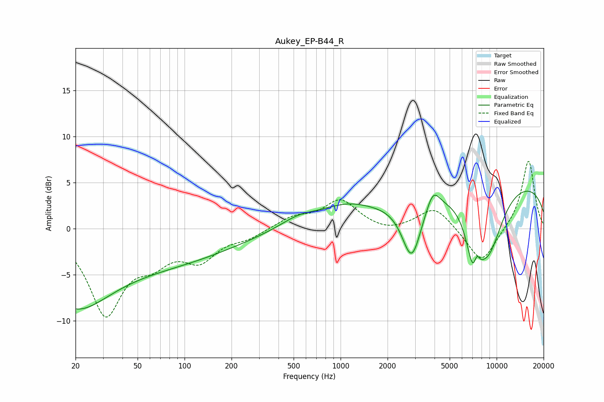

# Aukey_EP-B44_R
See [usage instructions](https://github.com/jaakkopasanen/AutoEq#usage) for more options and info.

### Parametric EQs
Apply preamp of -4.2 dB when using parametric equalizer.

|   # | Type    |   Fc (Hz) |    Q |   Gain (dB) |
|-----|---------|-----------|------|-------------|
|   1 | Peaking |        20 | 0.71 |        -4.7 |
|   2 | Peaking |        38 | 0.18 |        -4.2 |
|   3 | Peaking |       538 | 1.14 |         1.1 |
|   4 | Peaking |      1073 | 0.84 |         1.7 |
|   5 | Peaking |      2855 | 2.27 |        -6.4 |
|   6 | Peaking |      3909 | 3.33 |         2.1 |
|   7 | Peaking |      7198 | 3.01 |        -6.8 |
|   8 | Peaking |      7435 | 5.95 |         2.9 |
|   9 | Peaking |      8910 | 1.32 |        -6.6 |
|  10 | Peaking |     10000 | 0.18 |         5.4 |

### Fixed Band EQs
When using fixed band (also called graphic) equalizer, apply preamp of **-7.4 dB** (if available) and set gains manually with these parameters.

|   # | Type    |   Fc (Hz) |    Q |   Gain (dB) |
|-----|---------|-----------|------|-------------|
|   1 | Peaking |        31 | 1.41 |        -9   |
|   2 | Peaking |        62 | 1.41 |        -2.6 |
|   3 | Peaking |       125 | 1.41 |        -3   |
|   4 | Peaking |       250 | 1.41 |        -0.9 |
|   5 | Peaking |       500 | 1.41 |         1.2 |
|   6 | Peaking |      1000 | 1.41 |         3   |
|   7 | Peaking |      2000 | 1.41 |        -0.5 |
|   8 | Peaking |      4000 | 1.41 |         2.4 |
|   9 | Peaking |      8000 | 1.41 |        -3.9 |
|  10 | Peaking |     16000 | 1.41 |         7.5 |

### Graphs

