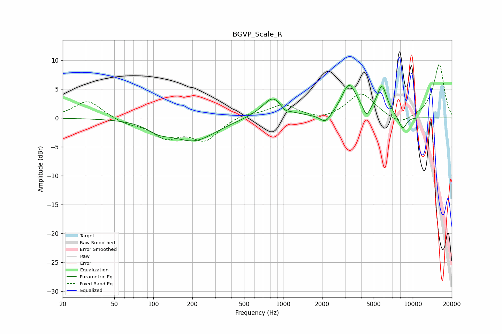

# BGVP_Scale_R
See [usage instructions](https://github.com/jaakkopasanen/AutoEq#usage) for more options and info.

### Parametric EQs
Apply preamp of -5.8 dB when using parametric equalizer.

|   # | Type    |   Fc (Hz) |    Q |   Gain (dB) |
|-----|---------|-----------|------|-------------|
|   1 | Peaking |       110 | 1.65 |        -1.3 |
|   2 | Peaking |       206 | 0.84 |        -3.8 |
|   3 | Peaking |       580 | 1.12 |         0.2 |
|   4 | Peaking |       841 | 1.77 |         3.7 |
|   5 | Peaking |      1026 | 4.01 |        -0.9 |
|   6 | Peaking |      2127 | 3.31 |        -1.7 |
|   7 | Peaking |      3227 | 2.41 |         5.6 |
|   8 | Peaking |      4401 | 5.99 |        -1.8 |
|   9 | Peaking |      5792 | 3.48 |         5.2 |
|  10 | Peaking |      8368 | 4.47 |        -2.4 |

### Fixed Band EQs
When using fixed band (also called graphic) equalizer, apply preamp of **-9.4 dB** (if available) and set gains manually with these parameters.

|   # | Type    |   Fc (Hz) |    Q |   Gain (dB) |
|-----|---------|-----------|------|-------------|
|   1 | Peaking |        31 | 1.41 |         3.1 |
|   2 | Peaking |        62 | 1.41 |        -0.9 |
|   3 | Peaking |       125 | 1.41 |        -3.1 |
|   4 | Peaking |       250 | 1.41 |        -3.6 |
|   5 | Peaking |       500 | 1.41 |         0.8 |
|   6 | Peaking |      1000 | 1.41 |         2.3 |
|   7 | Peaking |      2000 | 1.41 |        -0.6 |
|   8 | Peaking |      4000 | 1.41 |         4.3 |
|   9 | Peaking |      8000 | 1.41 |        -1.5 |
|  10 | Peaking |     16000 | 1.41 |         9.3 |

### Graphs

