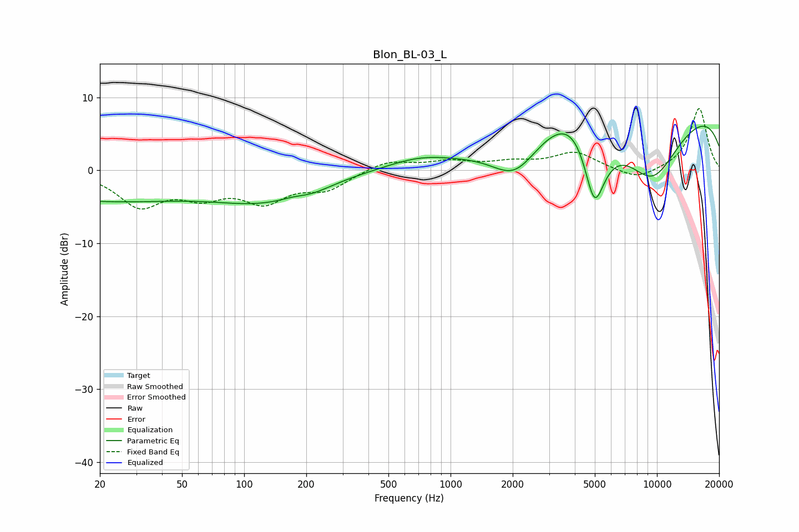

# Blon_BL-03_L
See [usage instructions](https://github.com/jaakkopasanen/AutoEq#usage) for more options and info.

### Parametric EQs
Apply preamp of -6.2 dB when using parametric equalizer.

|   # | Type    |   Fc (Hz) |    Q |   Gain (dB) |
|-----|---------|-----------|------|-------------|
|   1 | Peaking |        20 | 0.3  |        -4   |
|   2 | Peaking |       120 | 0.59 |        -3.3 |
|   3 | Peaking |       176 | 2.23 |         0.5 |
|   4 | Peaking |       201 | 1.21 |        -1.2 |
|   5 | Peaking |       697 | 0.89 |         1.4 |
|   6 | Peaking |      2054 | 1.23 |        -5.2 |
|   7 | Peaking |      4316 | 0.97 |         7.1 |
|   8 | Peaking |      4973 | 2.04 |       -14.3 |
|   9 | Peaking |      9430 | 0.77 |       -10.8 |
|  10 | Peaking |     10000 | 0.18 |        10.2 |

### Fixed Band EQs
When using fixed band (also called graphic) equalizer, apply preamp of **-8.6 dB** (if available) and set gains manually with these parameters.

|   # | Type    |   Fc (Hz) |    Q |   Gain (dB) |
|-----|---------|-----------|------|-------------|
|   1 | Peaking |        31 | 1.41 |        -4.6 |
|   2 | Peaking |        62 | 1.41 |        -2.9 |
|   3 | Peaking |       125 | 1.41 |        -3.8 |
|   4 | Peaking |       250 | 1.41 |        -2.3 |
|   5 | Peaking |       500 | 1.41 |         1.4 |
|   6 | Peaking |      1000 | 1.41 |         1.1 |
|   7 | Peaking |      2000 | 1.41 |         0.9 |
|   8 | Peaking |      4000 | 1.41 |         2.4 |
|   9 | Peaking |      8000 | 1.41 |        -1.5 |
|  10 | Peaking |     16000 | 1.41 |         8.6 |

### Graphs

