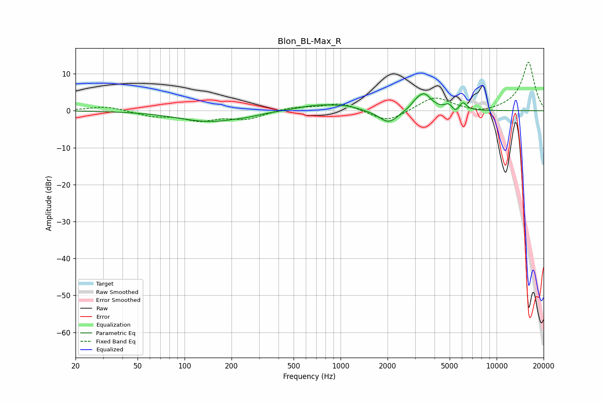

# Blon_BL-Max_R
See [usage instructions](https://github.com/jaakkopasanen/AutoEq#usage) for more options and info.

### Parametric EQs
Apply preamp of -4.7 dB when using parametric equalizer.

|   # | Type    |   Fc (Hz) |    Q |   Gain (dB) |
|-----|---------|-----------|------|-------------|
|   1 | Peaking |       145 | 0.7  |        -2.9 |
|   2 | Peaking |       250 | 2.04 |        -0.3 |
|   3 | Peaking |       761 | 0.91 |         1.8 |
|   4 | Peaking |      1108 | 2.32 |         0.5 |
|   5 | Peaking |      2031 | 2.29 |        -3.7 |
|   6 | Peaking |      3043 | 4.16 |         1   |
|   7 | Peaking |      3428 | 2.95 |         4.4 |
|   8 | Peaking |      4940 | 6    |         1.5 |
|   9 | Peaking |      5429 | 6    |        -1.3 |
|  10 | Peaking |      6081 | 5.99 |         2.1 |

### Fixed Band EQs
When using fixed band (also called graphic) equalizer, apply preamp of **-13.2 dB** (if available) and set gains manually with these parameters.

|   # | Type    |   Fc (Hz) |    Q |   Gain (dB) |
|-----|---------|-----------|------|-------------|
|   1 | Peaking |        31 | 1.41 |         1.3 |
|   2 | Peaking |        62 | 1.41 |        -1.3 |
|   3 | Peaking |       125 | 1.41 |        -2.4 |
|   4 | Peaking |       250 | 1.41 |        -2.1 |
|   5 | Peaking |       500 | 1.41 |         1   |
|   6 | Peaking |      1000 | 1.41 |         2.1 |
|   7 | Peaking |      2000 | 1.41 |        -3.2 |
|   8 | Peaking |      4000 | 1.41 |         3.8 |
|   9 | Peaking |      8000 | 1.41 |        -0.9 |
|  10 | Peaking |     16000 | 1.41 |        13.3 |

### Graphs

