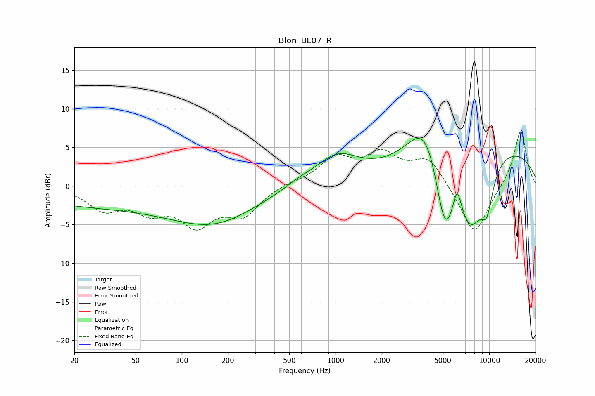

# Blon_BL07_R
See [usage instructions](https://github.com/jaakkopasanen/AutoEq#usage) for more options and info.

### Parametric EQs
Apply preamp of -6.2 dB when using parametric equalizer.

|   # | Type    |   Fc (Hz) |    Q |   Gain (dB) |
|-----|---------|-----------|------|-------------|
|   1 | Peaking |        44 | 0.18 |        -2.7 |
|   2 | Peaking |       169 | 0.55 |        -3.1 |
|   3 | Peaking |       572 | 1.67 |         0.5 |
|   4 | Peaking |      1022 | 0.98 |         3.7 |
|   5 | Peaking |      3932 | 1.21 |         7.8 |
|   6 | Peaking |      5139 | 1.81 |       -11.6 |
|   7 | Peaking |      6175 | 5.14 |         3.6 |
|   8 | Peaking |      7614 | 1.54 |        -8   |
|   9 | Peaking |      9648 | 2.95 |        -4.9 |
|  10 | Peaking |     10000 | 0.25 |         5.4 |

### Fixed Band EQs
When using fixed band (also called graphic) equalizer, apply preamp of **-7.1 dB** (if available) and set gains manually with these parameters.

|   # | Type    |   Fc (Hz) |    Q |   Gain (dB) |
|-----|---------|-----------|------|-------------|
|   1 | Peaking |        31 | 1.41 |        -2.8 |
|   2 | Peaking |        62 | 1.41 |        -2.7 |
|   3 | Peaking |       125 | 1.41 |        -4.5 |
|   4 | Peaking |       250 | 1.41 |        -3.5 |
|   5 | Peaking |       500 | 1.41 |         0.4 |
|   6 | Peaking |      1000 | 1.41 |         3.4 |
|   7 | Peaking |      2000 | 1.41 |         3.7 |
|   8 | Peaking |      4000 | 1.41 |         3.5 |
|   9 | Peaking |      8000 | 1.41 |        -6.6 |
|  10 | Peaking |     16000 | 1.41 |         7.4 |

### Graphs

