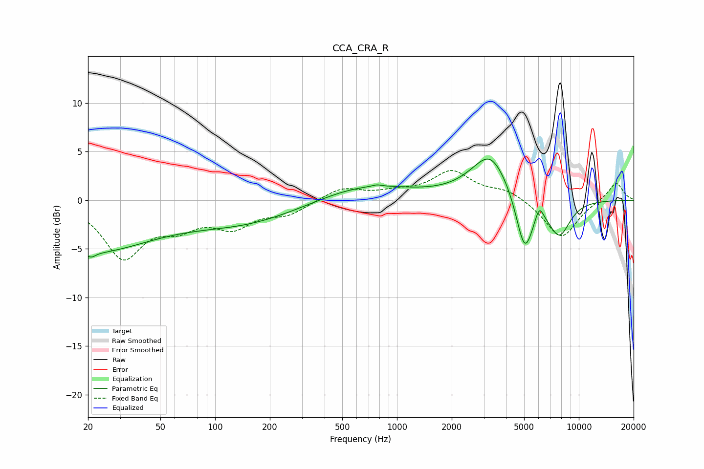

# CCA_CRA_R
See [usage instructions](https://github.com/jaakkopasanen/AutoEq#usage) for more options and info.

### Parametric EQs
Apply preamp of -4.3 dB when using parametric equalizer.

|   # | Type    |   Fc (Hz) |    Q |   Gain (dB) |
|-----|---------|-----------|------|-------------|
|   1 | Peaking |        20 | 0.4  |        -5.1 |
|   2 | Peaking |        21 | 5.73 |        -0.5 |
|   3 | Peaking |       144 | 0.44 |        -2.2 |
|   4 | Peaking |       649 | 0.55 |         1.7 |
|   5 | Peaking |       776 | 5.95 |         0.2 |
|   6 | Peaking |      3223 | 2.34 |         0.5 |
|   7 | Peaking |      3281 | 1.22 |         4.3 |
|   8 | Peaking |      5033 | 2.89 |        -6.1 |
|   9 | Peaking |      6061 | 6    |         1.5 |
|  10 | Peaking |      7809 | 2.18 |        -3.6 |

### Fixed Band EQs
When using fixed band (also called graphic) equalizer, apply preamp of **-3.1 dB** (if available) and set gains manually with these parameters.

|   # | Type    |   Fc (Hz) |    Q |   Gain (dB) |
|-----|---------|-----------|------|-------------|
|   1 | Peaking |        31 | 1.41 |        -5.7 |
|   2 | Peaking |        62 | 1.41 |        -2.1 |
|   3 | Peaking |       125 | 1.41 |        -2.4 |
|   4 | Peaking |       250 | 1.41 |        -1.3 |
|   5 | Peaking |       500 | 1.41 |         1.3 |
|   6 | Peaking |      1000 | 1.41 |         0.6 |
|   7 | Peaking |      2000 | 1.41 |         2.8 |
|   8 | Peaking |      4000 | 1.41 |         1   |
|   9 | Peaking |      8000 | 1.41 |        -4   |
|  10 | Peaking |     16000 | 1.41 |         1.9 |

### Graphs

