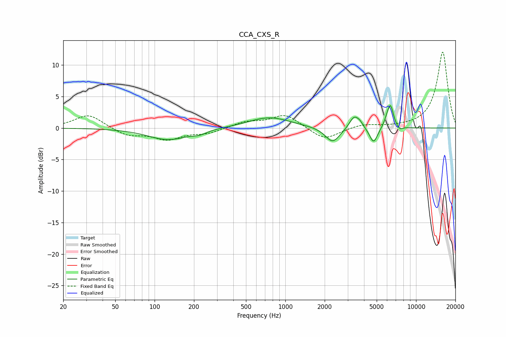

# CCA_CXS_R
See [usage instructions](https://github.com/jaakkopasanen/AutoEq#usage) for more options and info.

### Parametric EQs
Apply preamp of -3.7 dB when using parametric equalizer.

|   # | Type    |   Fc (Hz) |    Q |   Gain (dB) |
|-----|---------|-----------|------|-------------|
|   1 | Peaking |       127 | 0.92 |        -1.9 |
|   2 | Peaking |       220 | 2.7  |        -0.5 |
|   3 | Peaking |       755 | 0.89 |         1.7 |
|   4 | Peaking |      2302 | 2.51 |        -2.4 |
|   5 | Peaking |      3368 | 3.75 |         2   |
|   6 | Peaking |      3729 | 6    |         0.5 |
|   7 | Peaking |      4734 | 4.53 |        -2.5 |
|   8 | Peaking |      6016 | 5.99 |         0.9 |
|   9 | Peaking |      6384 | 5.9  |         3.3 |
|  10 | Peaking |      7501 | 6    |        -0.6 |

### Fixed Band EQs
When using fixed band (also called graphic) equalizer, apply preamp of **-12.1 dB** (if available) and set gains manually with these parameters.

|   # | Type    |   Fc (Hz) |    Q |   Gain (dB) |
|-----|---------|-----------|------|-------------|
|   1 | Peaking |        31 | 1.41 |         2.2 |
|   2 | Peaking |        62 | 1.41 |        -1.2 |
|   3 | Peaking |       125 | 1.41 |        -1.7 |
|   4 | Peaking |       250 | 1.41 |        -0.8 |
|   5 | Peaking |       500 | 1.41 |         0.9 |
|   6 | Peaking |      1000 | 1.41 |         2.1 |
|   7 | Peaking |      2000 | 1.41 |        -2   |
|   8 | Peaking |      4000 | 1.41 |         0.6 |
|   9 | Peaking |      8000 | 1.41 |         0.1 |
|  10 | Peaking |     16000 | 1.41 |        12.1 |

### Graphs

