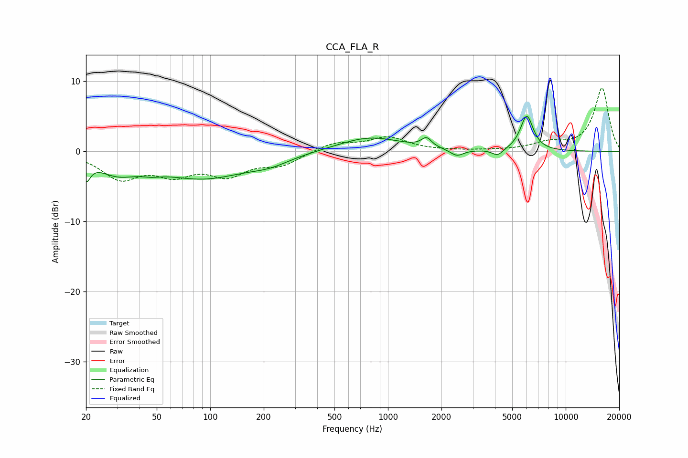

# CCA_FLA_R
See [usage instructions](https://github.com/jaakkopasanen/AutoEq#usage) for more options and info.

### Parametric EQs
Apply preamp of -5.1 dB when using parametric equalizer.

|   # | Type    |   Fc (Hz) |    Q |   Gain (dB) |
|-----|---------|-----------|------|-------------|
|   1 | Peaking |        20 | 5.93 |        -2.7 |
|   2 | Peaking |        30 | 1.28 |        -2.4 |
|   3 | Peaking |        47 | 2.43 |        -0.5 |
|   4 | Peaking |        91 | 0.57 |        -3.6 |
|   5 | Peaking |       217 | 1.29 |        -1   |
|   6 | Peaking |       790 | 0.79 |         2.1 |
|   7 | Peaking |      1648 | 5.06 |         1.3 |
|   8 | Peaking |      2443 | 3.75 |        -1   |
|   9 | Peaking |      4141 | 4.56 |        -1   |
|  10 | Peaking |      6040 | 3.8  |         5   |

### Fixed Band EQs
When using fixed band (also called graphic) equalizer, apply preamp of **-9.1 dB** (if available) and set gains manually with these parameters.

|   # | Type    |   Fc (Hz) |    Q |   Gain (dB) |
|-----|---------|-----------|------|-------------|
|   1 | Peaking |        31 | 1.41 |        -3.6 |
|   2 | Peaking |        62 | 1.41 |        -2.8 |
|   3 | Peaking |       125 | 1.41 |        -3   |
|   4 | Peaking |       250 | 1.41 |        -1.8 |
|   5 | Peaking |       500 | 1.41 |         1.2 |
|   6 | Peaking |      1000 | 1.41 |         1.9 |
|   7 | Peaking |      2000 | 1.41 |         0   |
|   8 | Peaking |      4000 | 1.41 |         0.1 |
|   9 | Peaking |      8000 | 1.41 |         1.1 |
|  10 | Peaking |     16000 | 1.41 |         9   |

### Graphs

