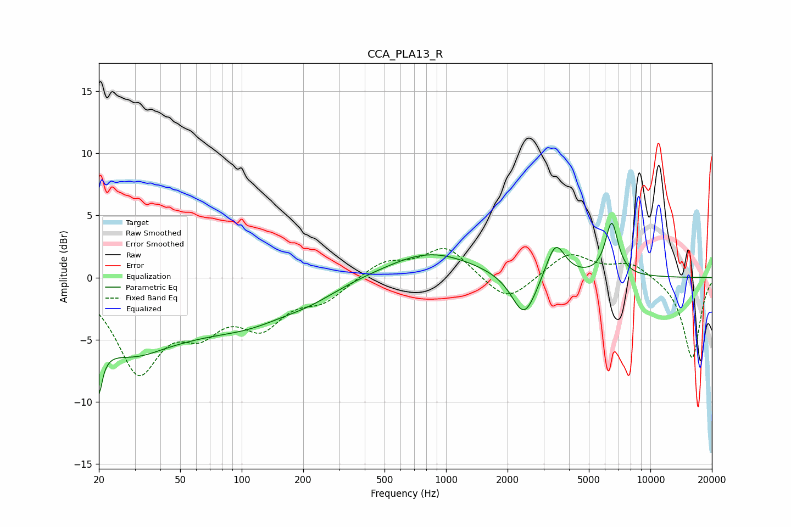

# CCA_PLA13_R
See [usage instructions](https://github.com/jaakkopasanen/AutoEq#usage) for more options and info.

### Parametric EQs
Apply preamp of -4.5 dB when using parametric equalizer.

|   # | Type    |   Fc (Hz) |    Q |   Gain (dB) |
|-----|---------|-----------|------|-------------|
|   1 | Peaking |        20 | 5.9  |        -7.4 |
|   2 | Peaking |        20 | 5.9  |         3.3 |
|   3 | Peaking |        30 | 0.52 |        -6.2 |
|   4 | Peaking |        41 | 1.11 |         0.6 |
|   5 | Peaking |       110 | 0.65 |        -2.4 |
|   6 | Peaking |       218 | 0.99 |        -0.8 |
|   7 | Peaking |       833 | 0.67 |         2.1 |
|   8 | Peaking |      2414 | 2.33 |        -3.6 |
|   9 | Peaking |      3432 | 3.02 |         3   |
|  10 | Peaking |      6468 | 4.4  |         4.3 |

### Fixed Band EQs
When using fixed band (also called graphic) equalizer, apply preamp of **-2.4 dB** (if available) and set gains manually with these parameters.

|   # | Type    |   Fc (Hz) |    Q |   Gain (dB) |
|-----|---------|-----------|------|-------------|
|   1 | Peaking |        31 | 1.41 |        -7.2 |
|   2 | Peaking |        62 | 1.41 |        -3.2 |
|   3 | Peaking |       125 | 1.41 |        -3.4 |
|   4 | Peaking |       250 | 1.41 |        -1.6 |
|   5 | Peaking |       500 | 1.41 |         1.3 |
|   6 | Peaking |      1000 | 1.41 |         2.5 |
|   7 | Peaking |      2000 | 1.41 |        -2.1 |
|   8 | Peaking |      4000 | 1.41 |         2   |
|   9 | Peaking |      8000 | 1.41 |         1.2 |
|  10 | Peaking |     16000 | 1.41 |        -6.5 |

### Graphs

