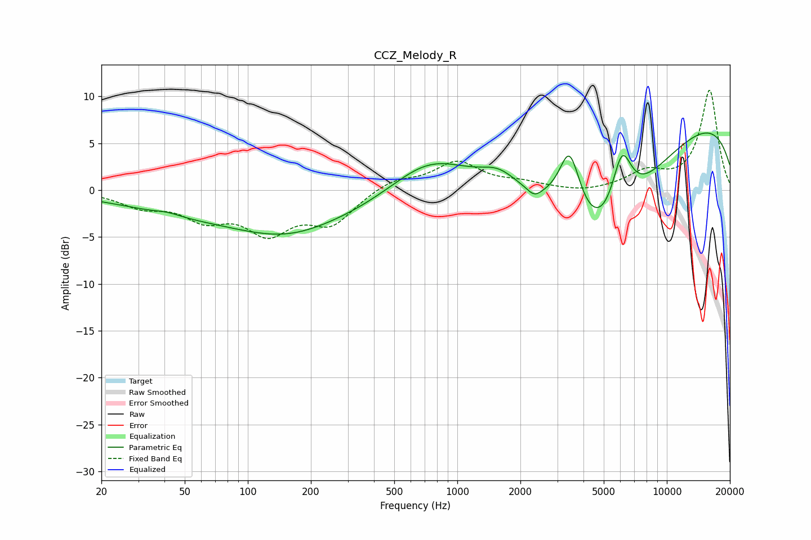

# CCZ_Melody_R
See [usage instructions](https://github.com/jaakkopasanen/AutoEq#usage) for more options and info.

### Parametric EQs
Apply preamp of -6.2 dB when using parametric equalizer.

|   # | Type    |   Fc (Hz) |    Q |   Gain (dB) |
|-----|---------|-----------|------|-------------|
|   1 | Peaking |        41 | 2.44 |         0.3 |
|   2 | Peaking |       144 | 0.19 |        -3.3 |
|   3 | Peaking |       152 | 0.67 |        -1.7 |
|   4 | Peaking |       729 | 0.72 |         4.4 |
|   5 | Peaking |      1568 | 1.73 |         1.5 |
|   6 | Peaking |      2330 | 4.1  |        -0.9 |
|   7 | Peaking |      3433 | 2.72 |         7   |
|   8 | Peaking |      4879 | 0.52 |       -14.4 |
|   9 | Peaking |      6099 | 2.77 |         6.7 |
|  10 | Peaking |      9004 | 0.18 |         9.8 |

### Fixed Band EQs
When using fixed band (also called graphic) equalizer, apply preamp of **-10.8 dB** (if available) and set gains manually with these parameters.

|   # | Type    |   Fc (Hz) |    Q |   Gain (dB) |
|-----|---------|-----------|------|-------------|
|   1 | Peaking |        31 | 1.41 |        -1.5 |
|   2 | Peaking |        62 | 1.41 |        -2.6 |
|   3 | Peaking |       125 | 1.41 |        -4.1 |
|   4 | Peaking |       250 | 1.41 |        -3.3 |
|   5 | Peaking |       500 | 1.41 |         1.2 |
|   6 | Peaking |      1000 | 1.41 |         2.9 |
|   7 | Peaking |      2000 | 1.41 |         0.6 |
|   8 | Peaking |      4000 | 1.41 |        -0.3 |
|   9 | Peaking |      8000 | 1.41 |         1.7 |
|  10 | Peaking |     16000 | 1.41 |        10.6 |

### Graphs

