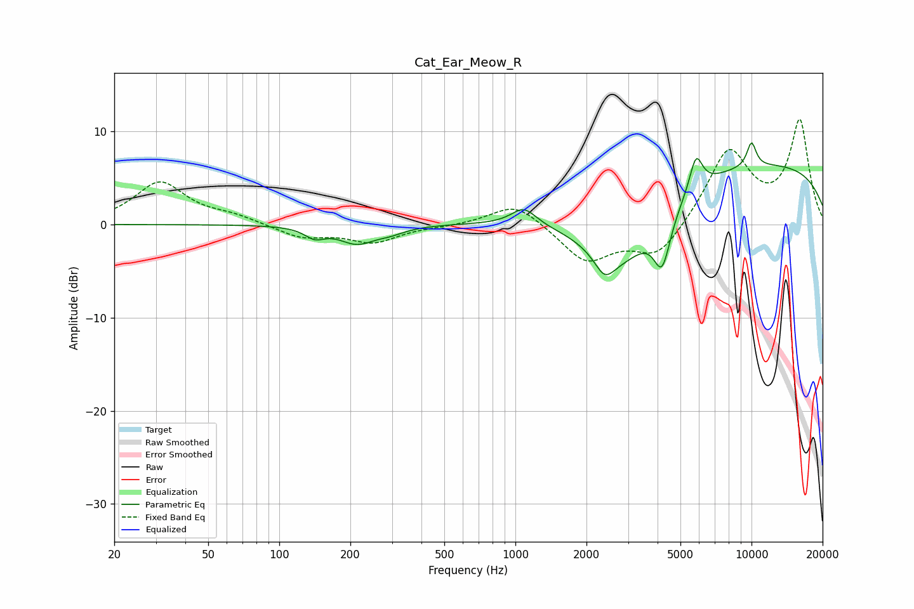

# Cat_Ear_Meow_R
See [usage instructions](https://github.com/jaakkopasanen/AutoEq#usage) for more options and info.

### Parametric EQs
Apply preamp of -8.9 dB when using parametric equalizer.

|   # | Type    |   Fc (Hz) |    Q |   Gain (dB) |
|-----|---------|-----------|------|-------------|
|   1 | Peaking |       141 | 3.35 |        -1.1 |
|   2 | Peaking |       213 | 1.89 |        -1.8 |
|   3 | Peaking |       294 | 2.17 |        -0.6 |
|   4 | Peaking |      1086 | 2.69 |         1.9 |
|   5 | Peaking |      2386 | 3.37 |        -2.2 |
|   6 | Peaking |      2791 | 0.84 |        -7.7 |
|   7 | Peaking |      4183 | 3.89 |        -5.5 |
|   8 | Peaking |      5821 | 4.97 |         3.8 |
|   9 | Peaking |      9274 | 0.18 |         6.8 |
|  10 | Peaking |     10000 | 6    |         2.7 |

### Fixed Band EQs
When using fixed band (also called graphic) equalizer, apply preamp of **-11.4 dB** (if available) and set gains manually with these parameters.

|   # | Type    |   Fc (Hz) |    Q |   Gain (dB) |
|-----|---------|-----------|------|-------------|
|   1 | Peaking |        31 | 1.41 |         4.5 |
|   2 | Peaking |        62 | 1.41 |         0.8 |
|   3 | Peaking |       125 | 1.41 |        -1.4 |
|   4 | Peaking |       250 | 1.41 |        -1.8 |
|   5 | Peaking |       500 | 1.41 |        -0.1 |
|   6 | Peaking |      1000 | 1.41 |         2.5 |
|   7 | Peaking |      2000 | 1.41 |        -4   |
|   8 | Peaking |      4000 | 1.41 |        -3.6 |
|   9 | Peaking |      8000 | 1.41 |         8   |
|  10 | Peaking |     16000 | 1.41 |        11   |

### Graphs

