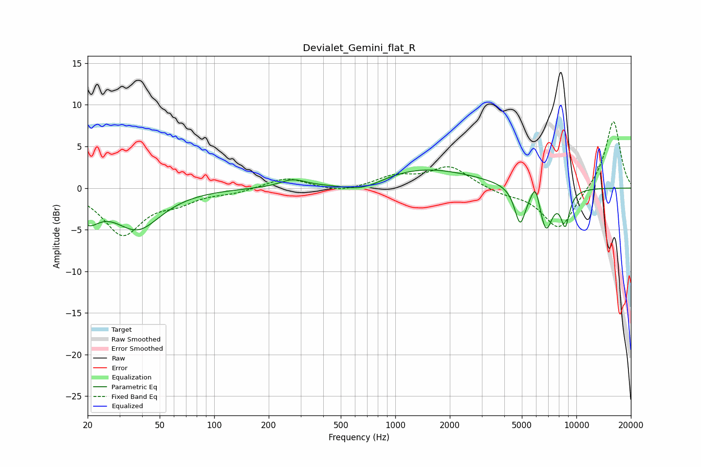

# Devialet_Gemini_flat_R
See [usage instructions](https://github.com/jaakkopasanen/AutoEq#usage) for more options and info.

### Parametric EQs
Apply preamp of -2.3 dB when using parametric equalizer.

|   # | Type    |   Fc (Hz) |    Q |   Gain (dB) |
|-----|---------|-----------|------|-------------|
|   1 | Peaking |        20 | 4.21 |        -0.3 |
|   2 | Peaking |        20 | 2.12 |        -2.7 |
|   3 | Peaking |        38 | 1.1  |        -4.7 |
|   4 | Peaking |       272 | 1.99 |         0.9 |
|   5 | Peaking |       660 | 1.2  |        -1.4 |
|   6 | Peaking |      1395 | 0.48 |         2.4 |
|   7 | Peaking |      4890 | 4.59 |        -4.4 |
|   8 | Peaking |      5954 | 5.98 |         2.4 |
|   9 | Peaking |      6783 | 3.64 |        -5   |
|  10 | Peaking |      8682 | 5.27 |        -4   |

### Fixed Band EQs
When using fixed band (also called graphic) equalizer, apply preamp of **-8.1 dB** (if available) and set gains manually with these parameters.

|   # | Type    |   Fc (Hz) |    Q |   Gain (dB) |
|-----|---------|-----------|------|-------------|
|   1 | Peaking |        31 | 1.41 |        -5.5 |
|   2 | Peaking |        62 | 1.41 |        -1.3 |
|   3 | Peaking |       125 | 1.41 |        -0.5 |
|   4 | Peaking |       250 | 1.41 |         1.3 |
|   5 | Peaking |       500 | 1.41 |        -0.6 |
|   6 | Peaking |      1000 | 1.41 |         1.3 |
|   7 | Peaking |      2000 | 1.41 |         2.5 |
|   8 | Peaking |      4000 | 1.41 |        -0.6 |
|   9 | Peaking |      8000 | 1.41 |        -5.1 |
|  10 | Peaking |     16000 | 1.41 |         8.3 |

### Graphs

