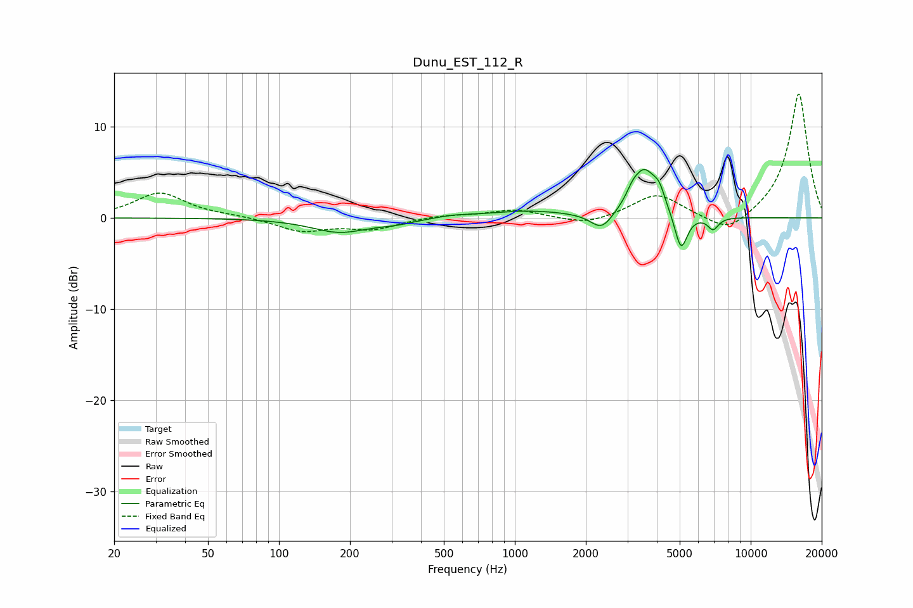

# Dunu_EST_112_R
See [usage instructions](https://github.com/jaakkopasanen/AutoEq#usage) for more options and info.

### Parametric EQs
Apply preamp of -5.4 dB when using parametric equalizer.

|   # | Type    |   Fc (Hz) |    Q |   Gain (dB) |
|-----|---------|-----------|------|-------------|
|   1 | Peaking |       180 | 1.18 |        -1.5 |
|   2 | Peaking |       313 | 1.68 |        -0.4 |
|   3 | Peaking |       546 | 1.93 |         0.2 |
|   4 | Peaking |      1134 | 0.81 |         0.7 |
|   5 | Peaking |      2337 | 3    |        -2   |
|   6 | Peaking |      3153 | 6    |         0.7 |
|   7 | Peaking |      3539 | 2.58 |         5.1 |
|   8 | Peaking |      4094 | 5.96 |         1.5 |
|   9 | Peaking |      5063 | 5.18 |        -4.2 |
|  10 | Peaking |      6928 | 6    |        -1.3 |

### Fixed Band EQs
When using fixed band (also called graphic) equalizer, apply preamp of **-13.7 dB** (if available) and set gains manually with these parameters.

|   # | Type    |   Fc (Hz) |    Q |   Gain (dB) |
|-----|---------|-----------|------|-------------|
|   1 | Peaking |        31 | 1.41 |         2.7 |
|   2 | Peaking |        62 | 1.41 |         0.2 |
|   3 | Peaking |       125 | 1.41 |        -1.4 |
|   4 | Peaking |       250 | 1.41 |        -1.2 |
|   5 | Peaking |       500 | 1.41 |         0.3 |
|   6 | Peaking |      1000 | 1.41 |         0.9 |
|   7 | Peaking |      2000 | 1.41 |        -0.9 |
|   8 | Peaking |      4000 | 1.41 |         2.6 |
|   9 | Peaking |      8000 | 1.41 |        -2   |
|  10 | Peaking |     16000 | 1.41 |        13.8 |

### Graphs

