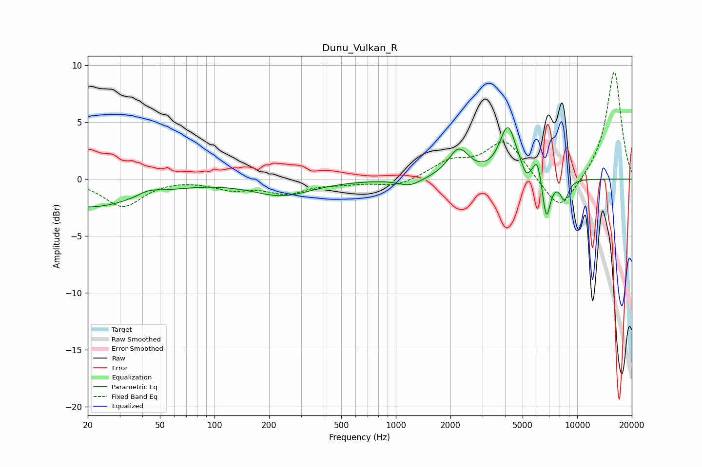

# Dunu_Vulkan_R
See [usage instructions](https://github.com/jaakkopasanen/AutoEq#usage) for more options and info.

### Parametric EQs
Apply preamp of -4.6 dB when using parametric equalizer.

|   # | Type    |   Fc (Hz) |    Q |   Gain (dB) |
|-----|---------|-----------|------|-------------|
|   1 | Peaking |        20 | 0.5  |        -2.5 |
|   2 | Peaking |        43 | 2.4  |         0.5 |
|   3 | Peaking |       236 | 0.86 |        -1.4 |
|   4 | Peaking |      1197 | 2.32 |        -0.7 |
|   5 | Peaking |      2222 | 2.46 |         2.5 |
|   6 | Peaking |      4149 | 3.02 |         4.5 |
|   7 | Peaking |      5233 | 5.99 |        -0.9 |
|   8 | Peaking |      6030 | 6    |         1.9 |
|   9 | Peaking |      6758 | 6    |        -3.8 |
|  10 | Peaking |      8503 | 5.34 |        -1.8 |

### Fixed Band EQs
When using fixed band (also called graphic) equalizer, apply preamp of **-9.5 dB** (if available) and set gains manually with these parameters.

|   # | Type    |   Fc (Hz) |    Q |   Gain (dB) |
|-----|---------|-----------|------|-------------|
|   1 | Peaking |        31 | 1.41 |        -2.4 |
|   2 | Peaking |        62 | 1.41 |         0.1 |
|   3 | Peaking |       125 | 1.41 |        -0.8 |
|   4 | Peaking |       250 | 1.41 |        -1.1 |
|   5 | Peaking |       500 | 1.41 |        -0.3 |
|   6 | Peaking |      1000 | 1.41 |        -0.7 |
|   7 | Peaking |      2000 | 1.41 |         1.4 |
|   8 | Peaking |      4000 | 1.41 |         3.4 |
|   9 | Peaking |      8000 | 1.41 |        -3.1 |
|  10 | Peaking |     16000 | 1.41 |         9.6 |

### Graphs

