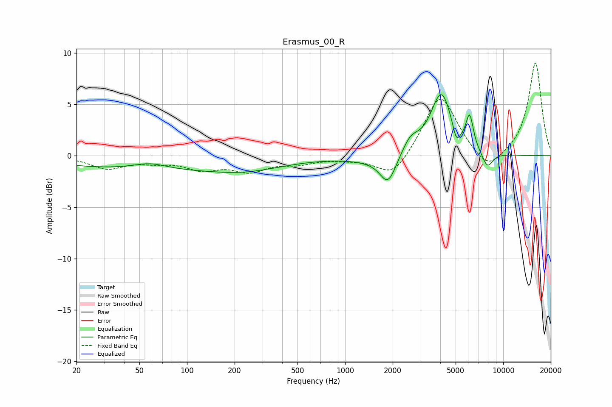

# Erasmus_00_R
See [usage instructions](https://github.com/jaakkopasanen/AutoEq#usage) for more options and info.

### Parametric EQs
Apply preamp of -6.0 dB when using parametric equalizer.

|   # | Type    |   Fc (Hz) |    Q |   Gain (dB) |
|-----|---------|-----------|------|-------------|
|   1 | Peaking |        58 | 1.32 |         0.6 |
|   2 | Peaking |        74 | 0.18 |        -1.4 |
|   3 | Peaking |       236 | 0.71 |        -0.5 |
|   4 | Peaking |      1442 | 1.04 |        -0.4 |
|   5 | Peaking |      1871 | 2.74 |        -2.7 |
|   6 | Peaking |      2594 | 2.67 |         1.4 |
|   7 | Peaking |      4065 | 2.07 |         6   |
|   8 | Peaking |      5050 | 5.99 |        -1.6 |
|   9 | Peaking |      6133 | 5.95 |         3.1 |
|  10 | Peaking |      7941 | 3.85 |        -1.6 |

### Fixed Band EQs
When using fixed band (also called graphic) equalizer, apply preamp of **-9.1 dB** (if available) and set gains manually with these parameters.

|   # | Type    |   Fc (Hz) |    Q |   Gain (dB) |
|-----|---------|-----------|------|-------------|
|   1 | Peaking |        31 | 1.41 |        -1.2 |
|   2 | Peaking |        62 | 1.41 |        -0.5 |
|   3 | Peaking |       125 | 1.41 |        -1.2 |
|   4 | Peaking |       250 | 1.41 |        -1.3 |
|   5 | Peaking |       500 | 1.41 |        -0.6 |
|   6 | Peaking |      1000 | 1.41 |        -0.2 |
|   7 | Peaking |      2000 | 1.41 |        -2.3 |
|   8 | Peaking |      4000 | 1.41 |         6.1 |
|   9 | Peaking |      8000 | 1.41 |        -1.9 |
|  10 | Peaking |     16000 | 1.41 |         9.1 |

### Graphs

