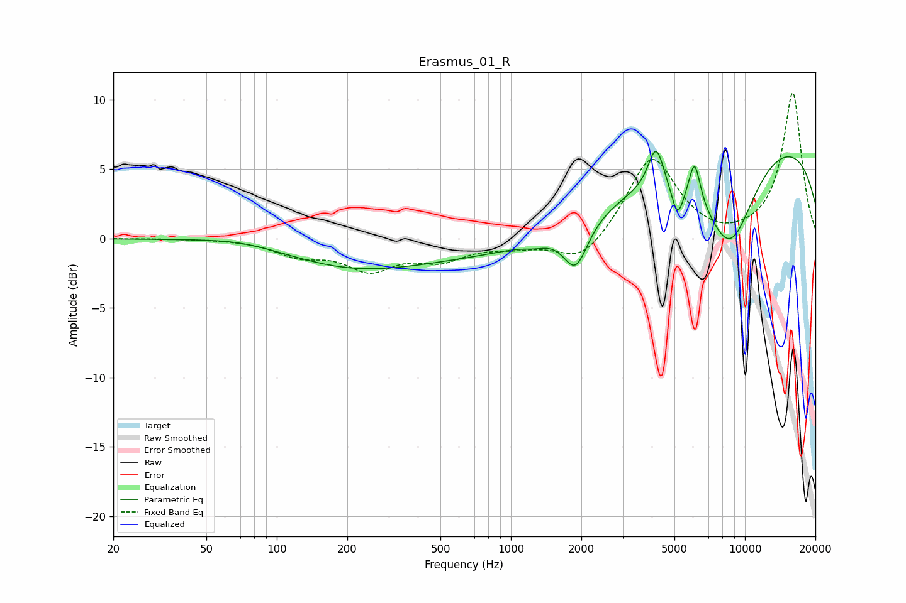

# Erasmus_01_R
See [usage instructions](https://github.com/jaakkopasanen/AutoEq#usage) for more options and info.

### Parametric EQs
Apply preamp of -6.4 dB when using parametric equalizer.

|   # | Type    |   Fc (Hz) |    Q |   Gain (dB) |
|-----|---------|-----------|------|-------------|
|   1 | Peaking |        71 | 0.86 |         0.4 |
|   2 | Peaking |       208 | 0.49 |        -1.9 |
|   3 | Peaking |      1269 | 2.91 |        -0.3 |
|   4 | Peaking |      1728 | 0.22 |        -1.6 |
|   5 | Peaking |      1892 | 2.69 |        -3.3 |
|   6 | Peaking |      4168 | 4.25 |         3.1 |
|   7 | Peaking |      5154 | 5.32 |        -2.4 |
|   8 | Peaking |      6096 | 5.83 |         2.9 |
|   9 | Peaking |      8606 | 1.12 |        -7.3 |
|  10 | Peaking |     10000 | 0.19 |         7.9 |

### Fixed Band EQs
When using fixed band (also called graphic) equalizer, apply preamp of **-10.6 dB** (if available) and set gains manually with these parameters.

|   # | Type    |   Fc (Hz) |    Q |   Gain (dB) |
|-----|---------|-----------|------|-------------|
|   1 | Peaking |        31 | 1.41 |         0   |
|   2 | Peaking |        62 | 1.41 |         0   |
|   3 | Peaking |       125 | 1.41 |        -1.1 |
|   4 | Peaking |       250 | 1.41 |        -2   |
|   5 | Peaking |       500 | 1.41 |        -1.3 |
|   6 | Peaking |      1000 | 1.41 |        -0.5 |
|   7 | Peaking |      2000 | 1.41 |        -1.9 |
|   8 | Peaking |      4000 | 1.41 |         6   |
|   9 | Peaking |      8000 | 1.41 |        -0.3 |
|  10 | Peaking |     16000 | 1.41 |        10.5 |

### Graphs

