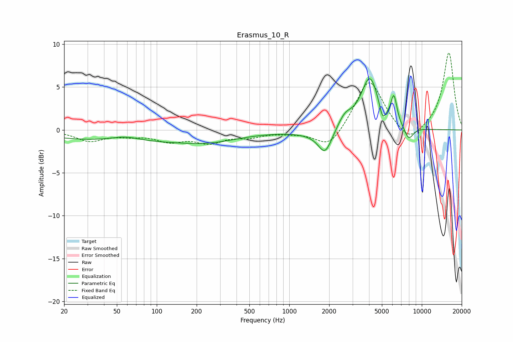

# Erasmus_10_R
See [usage instructions](https://github.com/jaakkopasanen/AutoEq#usage) for more options and info.

### Parametric EQs
Apply preamp of -6.1 dB when using parametric equalizer.

|   # | Type    |   Fc (Hz) |    Q |   Gain (dB) |
|-----|---------|-----------|------|-------------|
|   1 | Peaking |        58 | 1.28 |         0.6 |
|   2 | Peaking |        76 | 0.18 |        -1.4 |
|   3 | Peaking |       249 | 0.76 |        -0.5 |
|   4 | Peaking |      1525 | 1.04 |        -0.4 |
|   5 | Peaking |      1864 | 2.76 |        -2.7 |
|   6 | Peaking |      2633 | 2.64 |         1.4 |
|   7 | Peaking |      4056 | 2.1  |         6.1 |
|   8 | Peaking |      5054 | 5.99 |        -1.6 |
|   9 | Peaking |      6158 | 5.95 |         3.2 |
|  10 | Peaking |      7975 | 3.84 |        -1.5 |

### Fixed Band EQs
When using fixed band (also called graphic) equalizer, apply preamp of **-9.1 dB** (if available) and set gains manually with these parameters.

|   # | Type    |   Fc (Hz) |    Q |   Gain (dB) |
|-----|---------|-----------|------|-------------|
|   1 | Peaking |        31 | 1.41 |        -1.2 |
|   2 | Peaking |        62 | 1.41 |        -0.5 |
|   3 | Peaking |       125 | 1.41 |        -1.2 |
|   4 | Peaking |       250 | 1.41 |        -1.3 |
|   5 | Peaking |       500 | 1.41 |        -0.7 |
|   6 | Peaking |      1000 | 1.41 |        -0.2 |
|   7 | Peaking |      2000 | 1.41 |        -2.3 |
|   8 | Peaking |      4000 | 1.41 |         6.1 |
|   9 | Peaking |      8000 | 1.41 |        -1.8 |
|  10 | Peaking |     16000 | 1.41 |         9.1 |

### Graphs

