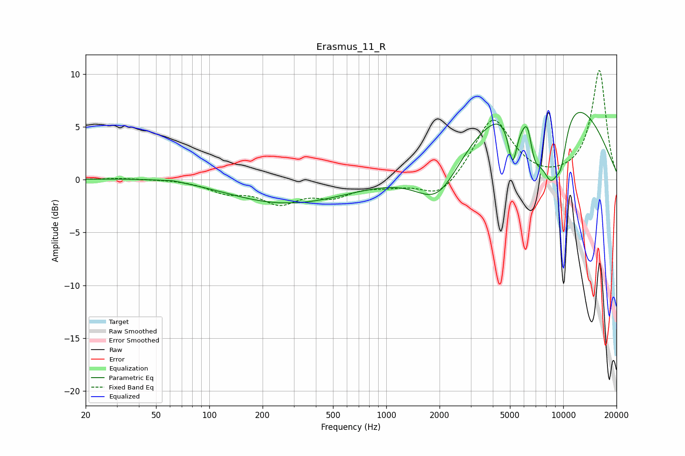

# Erasmus_11_R
See [usage instructions](https://github.com/jaakkopasanen/AutoEq#usage) for more options and info.

### Parametric EQs
Apply preamp of -6.5 dB when using parametric equalizer.

|   # | Type    |   Fc (Hz) |    Q |   Gain (dB) |
|-----|---------|-----------|------|-------------|
|   1 | Peaking |        62 | 3.3  |         0.1 |
|   2 | Peaking |       102 | 0.42 |         0.9 |
|   3 | Peaking |       234 | 0.38 |        -2.8 |
|   4 | Peaking |      1964 | 1.1  |        -4.3 |
|   5 | Peaking |      5176 | 5.25 |        -4.6 |
|   6 | Peaking |      6316 | 5.07 |         2.8 |
|   7 | Peaking |      6790 | 2.6  |        -5.4 |
|   8 | Peaking |      7766 | 0.34 |        10.5 |
|   9 | Peaking |      8536 | 2.04 |        -7.7 |
|  10 | Peaking |      9750 | 4.07 |        -3   |

### Fixed Band EQs
When using fixed band (also called graphic) equalizer, apply preamp of **-10.4 dB** (if available) and set gains manually with these parameters.

|   # | Type    |   Fc (Hz) |    Q |   Gain (dB) |
|-----|---------|-----------|------|-------------|
|   1 | Peaking |        31 | 1.41 |         0.1 |
|   2 | Peaking |        62 | 1.41 |         0.1 |
|   3 | Peaking |       125 | 1.41 |        -1   |
|   4 | Peaking |       250 | 1.41 |        -2   |
|   5 | Peaking |       500 | 1.41 |        -1.4 |
|   6 | Peaking |      1000 | 1.41 |        -0.4 |
|   7 | Peaking |      2000 | 1.41 |        -1.9 |
|   8 | Peaking |      4000 | 1.41 |         5.9 |
|   9 | Peaking |      8000 | 1.41 |        -0.2 |
|  10 | Peaking |     16000 | 1.41 |        10.3 |

### Graphs

