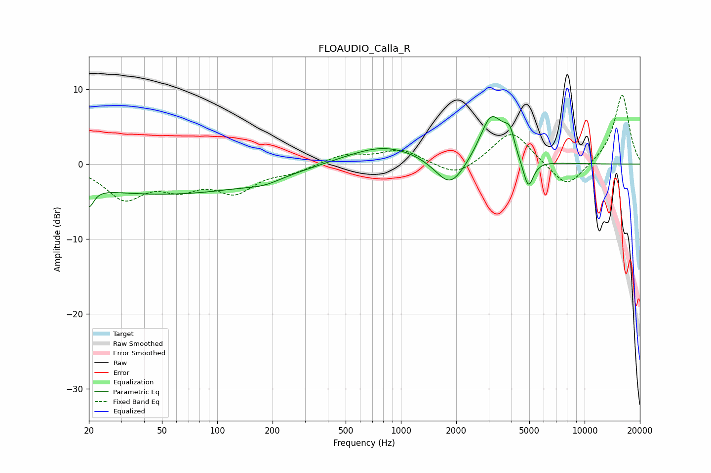

# FLOAUDIO_Calla_R
See [usage instructions](https://github.com/jaakkopasanen/AutoEq#usage) for more options and info.

### Parametric EQs
Apply preamp of -6.4 dB when using parametric equalizer.

|   # | Type    |   Fc (Hz) |    Q |   Gain (dB) |
|-----|---------|-----------|------|-------------|
|   1 | Peaking |        20 | 5.46 |        -2.6 |
|   2 | Peaking |        50 | 0.25 |        -4   |
|   3 | Peaking |       180 | 1.54 |        -0.7 |
|   4 | Peaking |       816 | 0.68 |         2.6 |
|   5 | Peaking |      1856 | 1.75 |        -4.1 |
|   6 | Peaking |      3096 | 2.21 |         6.5 |
|   7 | Peaking |      3699 | 3.37 |         2.7 |
|   8 | Peaking |      3800 | 2.65 |        -1.9 |
|   9 | Peaking |      3942 | 5.89 |         2.5 |
|  10 | Peaking |      4937 | 5.04 |        -3.9 |

### Fixed Band EQs
When using fixed band (also called graphic) equalizer, apply preamp of **-9.3 dB** (if available) and set gains manually with these parameters.

|   # | Type    |   Fc (Hz) |    Q |   Gain (dB) |
|-----|---------|-----------|------|-------------|
|   1 | Peaking |        31 | 1.41 |        -4.3 |
|   2 | Peaking |        62 | 1.41 |        -2.6 |
|   3 | Peaking |       125 | 1.41 |        -3.4 |
|   4 | Peaking |       250 | 1.41 |        -0.9 |
|   5 | Peaking |       500 | 1.41 |         1.3 |
|   6 | Peaking |      1000 | 1.41 |         1.9 |
|   7 | Peaking |      2000 | 1.41 |        -1.9 |
|   8 | Peaking |      4000 | 1.41 |         4.6 |
|   9 | Peaking |      8000 | 1.41 |        -3.5 |
|  10 | Peaking |     16000 | 1.41 |         9.4 |

### Graphs

