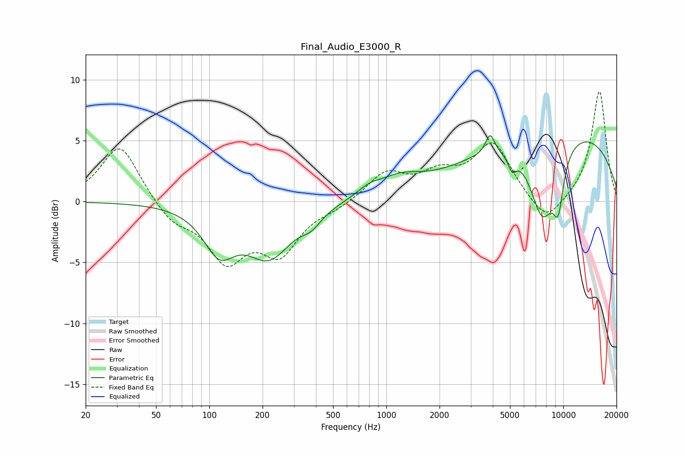

# Final_Audio_E3000_R
See [usage instructions](https://github.com/jaakkopasanen/AutoEq#usage) for more options and info.

### Parametric EQs
Apply preamp of -5.5 dB when using parametric equalizer.

|   # | Type    |   Fc (Hz) |    Q |   Gain (dB) |
|-----|---------|-----------|------|-------------|
|   1 | Peaking |       114 | 1.6  |        -3.5 |
|   2 | Peaking |       218 | 1.1  |        -4.2 |
|   3 | Peaking |       377 | 2.56 |        -1   |
|   4 | Peaking |       800 | 1.98 |         0.7 |
|   5 | Peaking |      1196 | 1.22 |         1.3 |
|   6 | Peaking |      3864 | 5.61 |         1.6 |
|   7 | Peaking |      5147 | 5.95 |        -1.2 |
|   8 | Peaking |      7630 | 1.77 |        -6.6 |
|   9 | Peaking |      9337 | 0.24 |         6.2 |
|  10 | Peaking |      9380 | 4.1  |        -3.9 |

### Fixed Band EQs
When using fixed band (also called graphic) equalizer, apply preamp of **-9.1 dB** (if available) and set gains manually with these parameters.

|   # | Type    |   Fc (Hz) |    Q |   Gain (dB) |
|-----|---------|-----------|------|-------------|
|   1 | Peaking |        31 | 1.41 |         4.8 |
|   2 | Peaking |        62 | 1.41 |        -1.6 |
|   3 | Peaking |       125 | 1.41 |        -4.5 |
|   4 | Peaking |       250 | 1.41 |        -3.9 |
|   5 | Peaking |       500 | 1.41 |        -0.5 |
|   6 | Peaking |      1000 | 1.41 |         2.3 |
|   7 | Peaking |      2000 | 1.41 |         1.9 |
|   8 | Peaking |      4000 | 1.41 |         4.6 |
|   9 | Peaking |      8000 | 1.41 |        -2.1 |
|  10 | Peaking |     16000 | 1.41 |         9.1 |

### Graphs

