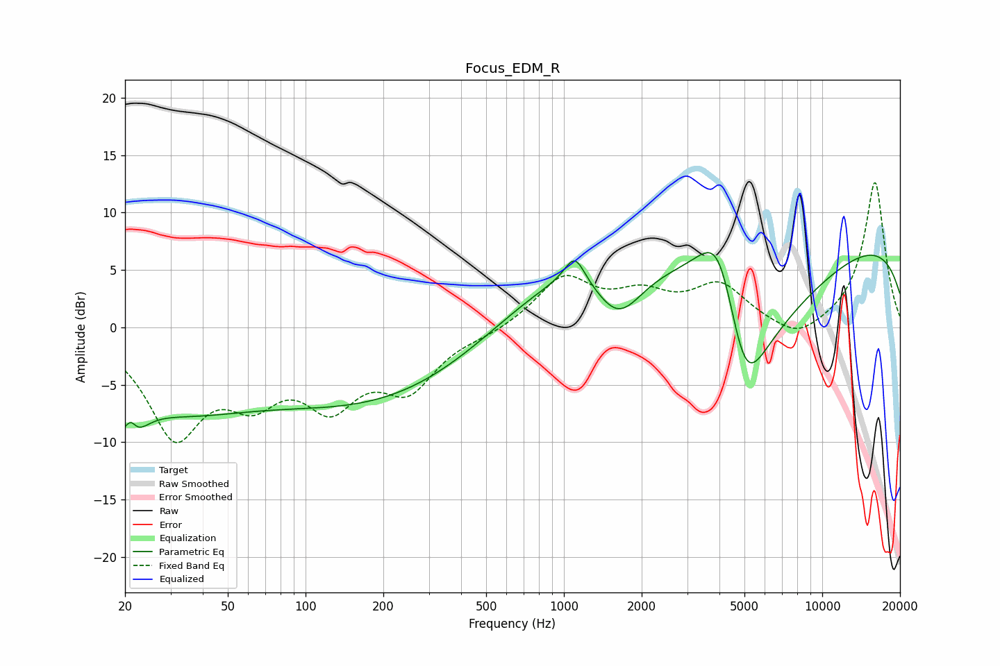

# Focus_EDM_R
See [usage instructions](https://github.com/jaakkopasanen/AutoEq#usage) for more options and info.

### Parametric EQs
Apply preamp of -6.6 dB when using parametric equalizer.

|   # | Type    |   Fc (Hz) |    Q |   Gain (dB) |
|-----|---------|-----------|------|-------------|
|   1 | Peaking |        21 | 2.89 |        -5.6 |
|   2 | Peaking |        21 | 5.77 |         3   |
|   3 | Peaking |        30 | 0.47 |        -5.7 |
|   4 | Peaking |       205 | 0.3  |        -6.6 |
|   5 | Peaking |      1102 | 3.63 |         2.4 |
|   6 | Peaking |      1286 | 0.39 |         7.6 |
|   7 | Peaking |      1626 | 1.39 |        -5.5 |
|   8 | Peaking |      4008 | 1.36 |        11.6 |
|   9 | Peaking |      4984 | 0.88 |       -20   |
|  10 | Peaking |     10000 | 0.18 |         8.7 |

### Fixed Band EQs
When using fixed band (also called graphic) equalizer, apply preamp of **-12.7 dB** (if available) and set gains manually with these parameters.

|   # | Type    |   Fc (Hz) |    Q |   Gain (dB) |
|-----|---------|-----------|------|-------------|
|   1 | Peaking |        31 | 1.41 |        -8.9 |
|   2 | Peaking |        62 | 1.41 |        -4.7 |
|   3 | Peaking |       125 | 1.41 |        -5.7 |
|   4 | Peaking |       250 | 1.41 |        -4.8 |
|   5 | Peaking |       500 | 1.41 |        -0.5 |
|   6 | Peaking |      1000 | 1.41 |         4.3 |
|   7 | Peaking |      2000 | 1.41 |         2.4 |
|   8 | Peaking |      4000 | 1.41 |         3.5 |
|   9 | Peaking |      8000 | 1.41 |        -1.5 |
|  10 | Peaking |     16000 | 1.41 |        12.7 |

### Graphs

