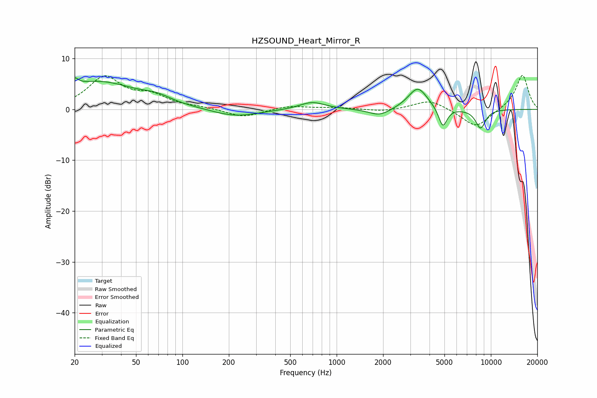

# HZSOUND_Heart_Mirror_R
See [usage instructions](https://github.com/jaakkopasanen/AutoEq#usage) for more options and info.

### Parametric EQs
Apply preamp of -6.3 dB when using parametric equalizer.

|   # | Type    |   Fc (Hz) |    Q |   Gain (dB) |
|-----|---------|-----------|------|-------------|
|   1 | Peaking |        20 | 5.99 |         4.6 |
|   2 | Peaking |        20 | 6    |        -3   |
|   3 | Peaking |        28 | 0.56 |         5.3 |
|   4 | Peaking |        69 | 1.58 |         1.1 |
|   5 | Peaking |       220 | 0.93 |        -1.5 |
|   6 | Peaking |       693 | 1.73 |         1.5 |
|   7 | Peaking |      1899 | 2.04 |        -1.4 |
|   8 | Peaking |      3362 | 2.27 |         4.4 |
|   9 | Peaking |      4884 | 5.03 |        -4   |
|  10 | Peaking |      8576 | 3.88 |        -3.7 |

### Fixed Band EQs
When using fixed band (also called graphic) equalizer, apply preamp of **-6.8 dB** (if available) and set gains manually with these parameters.

|   # | Type    |   Fc (Hz) |    Q |   Gain (dB) |
|-----|---------|-----------|------|-------------|
|   1 | Peaking |        31 | 1.41 |         6.2 |
|   2 | Peaking |        62 | 1.41 |         2.3 |
|   3 | Peaking |       125 | 1.41 |         0.3 |
|   4 | Peaking |       250 | 1.41 |        -1.6 |
|   5 | Peaking |       500 | 1.41 |         0.7 |
|   6 | Peaking |      1000 | 1.41 |         0.3 |
|   7 | Peaking |      2000 | 1.41 |        -0.5 |
|   8 | Peaking |      4000 | 1.41 |         1.9 |
|   9 | Peaking |      8000 | 1.41 |        -3.7 |
|  10 | Peaking |     16000 | 1.41 |         6.9 |

### Graphs

