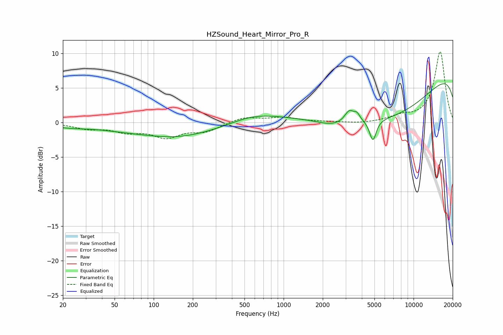

# HZSound_Heart_Mirror_Pro_R
See [usage instructions](https://github.com/jaakkopasanen/AutoEq#usage) for more options and info.

### Parametric EQs
Apply preamp of -5.7 dB when using parametric equalizer.

|   # | Type    |   Fc (Hz) |    Q |   Gain (dB) |
|-----|---------|-----------|------|-------------|
|   1 | Peaking |        22 | 1.04 |        -0.4 |
|   2 | Peaking |       151 | 0.85 |        -0.4 |
|   3 | Peaking |       156 | 0.28 |        -1.9 |
|   4 | Peaking |       580 | 0.67 |         1.7 |
|   5 | Peaking |      2395 | 1.15 |        -0.9 |
|   6 | Peaking |      3198 | 3.98 |         1.7 |
|   7 | Peaking |      3666 | 5.97 |         0.9 |
|   8 | Peaking |      4865 | 5.47 |        -3.1 |
|   9 | Peaking |      7031 | 0.28 |       -11.3 |
|  10 | Peaking |     10000 | 0.18 |        13   |

### Fixed Band EQs
When using fixed band (also called graphic) equalizer, apply preamp of **-10.3 dB** (if available) and set gains manually with these parameters.

|   # | Type    |   Fc (Hz) |    Q |   Gain (dB) |
|-----|---------|-----------|------|-------------|
|   1 | Peaking |        31 | 1.41 |        -0.8 |
|   2 | Peaking |        62 | 1.41 |        -1.1 |
|   3 | Peaking |       125 | 1.41 |        -1.9 |
|   4 | Peaking |       250 | 1.41 |        -1.2 |
|   5 | Peaking |       500 | 1.41 |         0.8 |
|   6 | Peaking |      1000 | 1.41 |         0.7 |
|   7 | Peaking |      2000 | 1.41 |         0.1 |
|   8 | Peaking |      4000 | 1.41 |        -0.2 |
|   9 | Peaking |      8000 | 1.41 |         0.8 |
|  10 | Peaking |     16000 | 1.41 |        10.3 |

### Graphs

