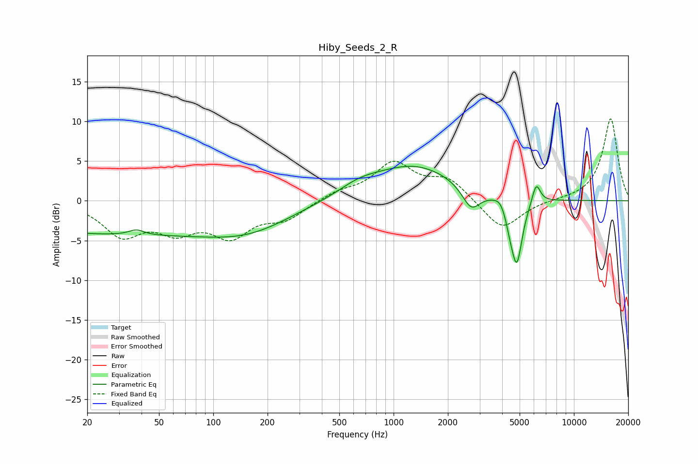

# Hiby_Seeds_2_R
See [usage instructions](https://github.com/jaakkopasanen/AutoEq#usage) for more options and info.

### Parametric EQs
Apply preamp of -4.4 dB when using parametric equalizer.

|   # | Type    |   Fc (Hz) |    Q |   Gain (dB) |
|-----|---------|-----------|------|-------------|
|   1 | Peaking |        26 | 0.19 |        -4.1 |
|   2 | Peaking |        37 | 3.45 |         0.7 |
|   3 | Peaking |       161 | 0.59 |        -2.6 |
|   4 | Peaking |       641 | 1.29 |         1   |
|   5 | Peaking |      1297 | 0.58 |         4.4 |
|   6 | Peaking |      2693 | 2.82 |        -2.9 |
|   7 | Peaking |      3901 | 4.82 |         0.8 |
|   8 | Peaking |      4421 | 6    |        -1.5 |
|   9 | Peaking |      4823 | 4.48 |        -8.1 |
|  10 | Peaking |      6177 | 5.96 |         2.6 |

### Fixed Band EQs
When using fixed band (also called graphic) equalizer, apply preamp of **-10.4 dB** (if available) and set gains manually with these parameters.

|   # | Type    |   Fc (Hz) |    Q |   Gain (dB) |
|-----|---------|-----------|------|-------------|
|   1 | Peaking |        31 | 1.41 |        -4.1 |
|   2 | Peaking |        62 | 1.41 |        -3.2 |
|   3 | Peaking |       125 | 1.41 |        -4   |
|   4 | Peaking |       250 | 1.41 |        -2.1 |
|   5 | Peaking |       500 | 1.41 |         1   |
|   6 | Peaking |      1000 | 1.41 |         4.6 |
|   7 | Peaking |      2000 | 1.41 |         2.6 |
|   8 | Peaking |      4000 | 1.41 |        -3.8 |
|   9 | Peaking |      8000 | 1.41 |         0.1 |
|  10 | Peaking |     16000 | 1.41 |        10.4 |

### Graphs

