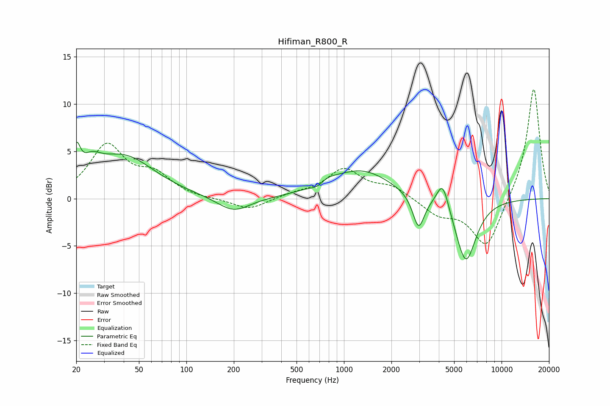

# Hifiman_R800_R
See [usage instructions](https://github.com/jaakkopasanen/AutoEq#usage) for more options and info.

### Parametric EQs
Apply preamp of -6.0 dB when using parametric equalizer.

|   # | Type    |   Fc (Hz) |    Q |   Gain (dB) |
|-----|---------|-----------|------|-------------|
|   1 | Peaking |        20 | 5.86 |         3.1 |
|   2 | Peaking |        25 | 2.38 |         1.7 |
|   3 | Peaking |        40 | 0.72 |         4.4 |
|   4 | Peaking |       200 | 1.37 |        -1.6 |
|   5 | Peaking |       691 | 2.67 |        -1.4 |
|   6 | Peaking |       727 | 2.03 |         1.6 |
|   7 | Peaking |      1300 | 0.75 |         2.9 |
|   8 | Peaking |      2974 | 3.84 |        -3.6 |
|   9 | Peaking |      4233 | 3.71 |         2.9 |
|  10 | Peaking |      5928 | 2.09 |        -6.8 |

### Fixed Band EQs
When using fixed band (also called graphic) equalizer, apply preamp of **-11.6 dB** (if available) and set gains manually with these parameters.

|   # | Type    |   Fc (Hz) |    Q |   Gain (dB) |
|-----|---------|-----------|------|-------------|
|   1 | Peaking |        31 | 1.41 |         5.5 |
|   2 | Peaking |        62 | 1.41 |         2.2 |
|   3 | Peaking |       125 | 1.41 |        -0.1 |
|   4 | Peaking |       250 | 1.41 |        -1.2 |
|   5 | Peaking |       500 | 1.41 |         0.4 |
|   6 | Peaking |      1000 | 1.41 |         3   |
|   7 | Peaking |      2000 | 1.41 |         1.2 |
|   8 | Peaking |      4000 | 1.41 |        -1.6 |
|   9 | Peaking |      8000 | 1.41 |        -5.3 |
|  10 | Peaking |     16000 | 1.41 |        11.9 |

### Graphs

