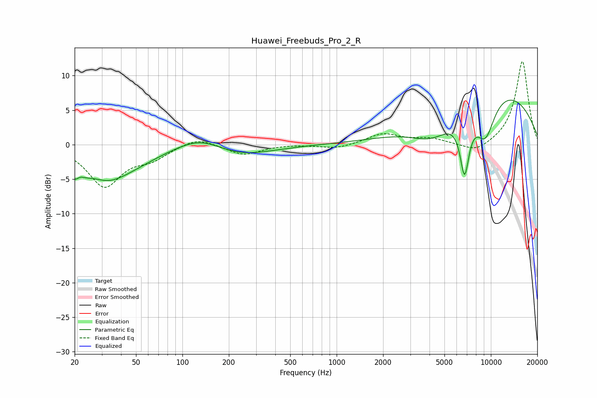

# Huawei_Freebuds_Pro_2_R
See [usage instructions](https://github.com/jaakkopasanen/AutoEq#usage) for more options and info.

### Parametric EQs
Apply preamp of -6.5 dB when using parametric equalizer.

|   # | Type    |   Fc (Hz) |    Q |   Gain (dB) |
|-----|---------|-----------|------|-------------|
|   1 | Peaking |        21 | 2.83 |        -4.5 |
|   2 | Peaking |        21 | 4.21 |         2.4 |
|   3 | Peaking |        33 | 1.51 |        -1.1 |
|   4 | Peaking |        37 | 0.66 |        -3.9 |
|   5 | Peaking |       134 | 0.86 |         2.5 |
|   6 | Peaking |       211 | 0.64 |        -2.2 |
|   7 | Peaking |      4200 | 0.97 |        -3.7 |
|   8 | Peaking |      6754 | 4.36 |        -8.4 |
|   9 | Peaking |      9204 | 1.95 |        -6   |
|  10 | Peaking |     10000 | 0.3  |         8.4 |

### Fixed Band EQs
When using fixed band (also called graphic) equalizer, apply preamp of **-12.1 dB** (if available) and set gains manually with these parameters.

|   # | Type    |   Fc (Hz) |    Q |   Gain (dB) |
|-----|---------|-----------|------|-------------|
|   1 | Peaking |        31 | 1.41 |        -5.9 |
|   2 | Peaking |        62 | 1.41 |        -1.7 |
|   3 | Peaking |       125 | 1.41 |         1.2 |
|   4 | Peaking |       250 | 1.41 |        -1.5 |
|   5 | Peaking |       500 | 1.41 |         0.1 |
|   6 | Peaking |      1000 | 1.41 |        -0.6 |
|   7 | Peaking |      2000 | 1.41 |         1.6 |
|   8 | Peaking |      4000 | 1.41 |         0.8 |
|   9 | Peaking |      8000 | 1.41 |        -1.3 |
|  10 | Peaking |     16000 | 1.41 |        12.2 |

### Graphs

